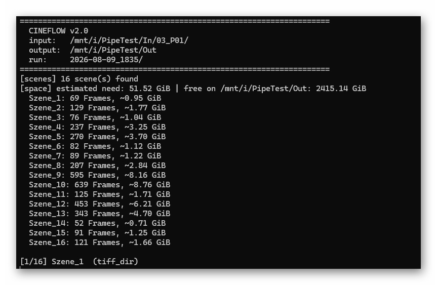
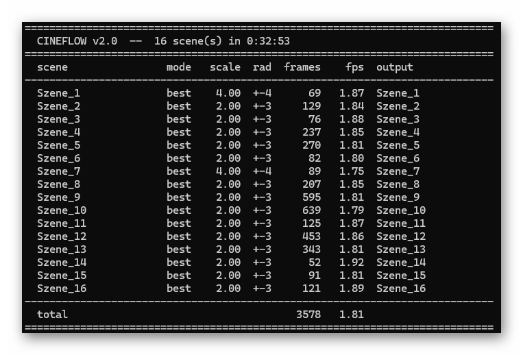
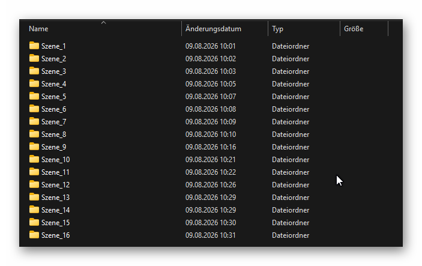
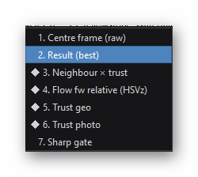
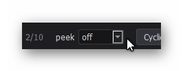

# cineFlow — a tool set for degraining small-gauge film scans

## Contents

- [1. What is it?](#1-what-is-it)
- [2. Simple Examples](#2-simple-examples)
  - [2.1 Degrained footage in less than 5 Minutes](#21-degrained-footage-in-less-than-5-minutes)
    - [2.1.A Start flowQt](#21a-start-flowqt)
    - [2.1.B Load some material](#21b-load-some-material)
    - [2.1.C Switch to the Output view](#21c-switch-to-the-output-view)
    - [2.1.D Writing out the degrained result](#21d-writing-out-the-degrained-result)
  - [2.2 One slider to rule them all](#22-one-slider-to-rule-them-all)
    - [2.2.A Setting the amount = 0](#22a-setting-the-amount-0)
    - [2.2.B amount at maximum](#22b-amount-at-maximum)
    - [2.2.C Somewhere in between](#22c-somewhere-in-between)
    - [2.2.D Saving the recipe](#22d-saving-the-recipe)
  - [2.3 Let's start running — many scenes at once: cineFlow batchmode](#23-lets-start-running-many-scenes-at-once-cineflow-batchmode)
    - [2.3.A The simplest invocation of cineFlow](#23a-the-simplest-invocation-of-cineflow)
    - [2.3.B Where the recipe comes from](#23b-where-the-recipe-comes-from)
    - [2.3.C Better than mp4](#23c-better-than-mp4)
    - [2.3.D What else you get](#23d-what-else-you-get)
  - [2.4 The full quality, finally](#24-the-full-quality-finally)
    - [2.4.A How it goes](#24a-how-it-goes)
- [3. Principle of operation](#3-principle-of-operation)
  - [3.1 Basic Concept](#31-basic-concept)
  - [3.2 The four steps](#32-the-four-steps)
  - [3.3 Where the safeguard sits](#33-where-the-safeguard-sits)
  - [3.4 And the second half?](#34-and-the-second-half)
- [4. Reading the views](#4-reading-the-views)
  - [4.1 Navigation](#41-navigation)
    - [4.1.A Moving through the film](#41a-moving-through-the-film)
    - [4.1.B Moving between views](#41b-moving-between-views)
    - [4.1.C Zoom and pan](#41c-zoom-and-pan)
    - [4.1.D Flipping](#41d-flipping)
    - [4.1.E Split-View Mode](#41e-split-view-mode)
    - [4.1.F Peek](#41f-peek)
  - [4.2 The most important views in detail](#42-the-most-important-views-in-detail)
    - [4.2.A Input](#42a-input)
    - [4.2.B Output](#42b-output)
    - [4.2.C Neighbour × trust](#42c-neighbour-trust)
    - [4.2.D Trust geo · Trust photo](#42d-trust-geo-trust-photo)
    - [4.2.E Trust](#42e-trust)
    - [4.2.F Sharp gate](#42f-sharp-gate)
- [5. Best Practices](#5-best-practices)
  - [5.1 Pick the right frame](#51-pick-the-right-frame)
  - [5.2 Get the flow right first](#52-get-the-flow-right-first)
  - [5.3 Find out how far the flow carries](#53-find-out-how-far-the-flow-carries)
  - [5.4 Then adjust the trusts](#54-then-adjust-the-trusts)
  - [5.5 Enhance last](#55-enhance-last)
  - [5.6 Render a short test](#56-render-a-short-test)
  - [5.7 Save the recipe, then let the batch run](#57-save-the-recipe-then-let-the-batch-run)
  - [5.8 Which flow method](#58-which-flow-method)
  - [5.9 How to be wrong](#59-how-to-be-wrong)
- [6. Export from your NLE](#6-export-from-your-nle)
  - [6.1 The export settings](#61-the-export-settings)
  - [6.2 Coming back](#62-coming-back)
- [7. Dust and scratches](#7-dust-and-scratches)
- [Appendix A — The other views](#appendix-a-the-other-views)
  - [A.1 Flow fw (HSV) · Warped flow bw (HSV)](#a1-flow-fw-hsv-warped-flow-bw-hsv)
  - [A.2 Texture weight](#a2-texture-weight)
- [Appendix B — The settings in detail](#appendix-b-the-settings-in-detail)
  - [B.1 Engine](#b1-engine)
    - [B.1.A flow — RAFT / DIS](#b1a-flow-raft-dis)
    - [B.1.B mode — best / dustA / dustB](#b1b-mode-best-dusta-dustb)
    - [B.1.C downscale](#b1c-downscale)
    - [B.1.D context](#b1d-context)
  - [B.2 Trust](#b2-trust)
    - [B.2.A geo tab — mismatch [px] · softness](#b2a-geo-tab-mismatch-px-softness)
    - [B.2.B photo tab — mismatch [0..1] · softness · smooth [px]](#b2b-photo-tab-mismatch-01-softness-smooth-px)
    - [B.2.C dustA tab — mismatch [MAD] · softness · center_weight](#b2c-dusta-tab-mismatch-mad-softness-center_weight)
    - [B.2.D dustB tab — mismatch [spread] · softness · disagreement · disagreement softness](#b2d-dustb-tab-mismatch-spread-softness-disagreement-disagreement-softness)
  - [B.3 Enhance](#b3-enhance)
    - [B.3.A amount](#b3a-amount)
    - [B.3.B texture tab — full · gamma · base](#b3b-texture-tab-full-gamma-base)
    - [B.3.C filter tab — guided / unsharp · sigma · eps](#b3c-filter-tab-guided-unsharp-sigma-eps)
  - [B.4 Slots and recipes](#b4-slots-and-recipes)
  - [B.5 Autoplay and Record](#b5-autoplay-and-record)
    - [B.5.A step size, play / pause](#b5a-step-size-play-pause)
    - [B.5.B REC — mp4 / ProRes / TIFF](#b5b-rec-mp4-prores-tiff)
- [Appendix C — Keyboard reference](#appendix-c-keyboard-reference)
  - [C.1 Navigation](#c1-navigation)
  - [C.2 View](#c2-view)
  - [C.3 Autoplay and recording](#c3-autoplay-and-recording)
  - [C.4 Parameters and files](#c4-parameters-and-files)

---

# 1. What is it?

Old small-gauge film is grainy. In darker parts of the image so
grainy that the actual image content is barely visible.

In the old days, projecting the footage onto the silver screen in
a darkened room, things worked out mostly - your visual system is 
quite capable of seeing through the grain in this situation.

However, digitized analog material is viewed under quite different
conditions: normally in a brightly lit office environment, on a 
normal computer display. It's much harder here to "see through the
noise".

cineFlow is a program suite which tries to restore as best as it 
can the original image content - that is, what was contained in 
the original scene. Contrary to other approaches to increase 
visual quality of archive material, cineFlow tries very hard **not** 
to invent things not present in the material.

> If you want to know why this works at all, and where it stops
> working, see chapter 3. For now the short version is enough: *no
> invented detail.*

cineFlow consists of two basic elements:

+ **flowQt**: this is an interactive GUI, where you can optimize 
various processing parameters for a whole film or specific scenes. 

+ **cineFlow**: is the companion-software. It's a batch-program, 
  speed-optimized, using, if available, GPU-power. 
  
Currently, the software is tested under Win11 and WSL2 with the
appropriate libraries installed. It is expected to run on any
hardware with a python interpreter.   

---

# 2. Simple Examples

In the following 5 different ways of using cineFlow are described.
We start with a simple example and finish with scene-specific 
processing via fast batch-rendering.

## 2.1 Degrained footage in less than 5 Minutes

The goal here is a degrained video without adjusting or understanding
anything.

### 2.1.A Start flowQt

flowQt is the interactive front end of the software suite. Start it
by

```
python flowQt.py
```


On the right you will see a wall of sliders. Ignore them. We will not
touch a single one in this section.

### 2.1.B Load some material

Simply drag a video file onto the large area. That is the entire loading
procedure. In case your material sits as .tif-Frames in a single directory,
you can drop such a dir instead of the video. flowQt will happily accept
both formats.


flowQt reads the file and shows you the first frame of the video.

### 2.1.C Switch to the Output view

What is displayed on the main view is indicated in the top-left 
corner in the "View:" selection dialog. It should sit on 
"1. Input". Switch it to "2. Output (best)", simply by pressing
the numberkey "2". 


It will take a while, depending on your hardware
up to 4 seconds, until the main display updates, as a lot of 
computations need to happen before the output image is displayed.

Once you see "2. Output (best)" as selected view, you are ready 
to write out the result. 

> In case you want to compare input and output, you can switch 
> immediately between these two views by using the numberkeys "1"
> for the input and "2" for the output. Another way is to use 
> the Up- and Down-Cursor keys. This cycles through a preset
> list of views. If you get lost, remember "2" always brings 
> you back to the output view. For more info about navigation and
> views, see chapter 4.

### 2.1.D Writing out the degrained result

At the bottom right there is a box labelled **Autoplay | Record**.


1. Go to the first frame of your footage (`Home`).
2. Make sure you are on the "2. Output (best)" page and the split-view
   option is off (it is off if you do not see a vertical yellow line. Press key "l" until the yellow line disappears).
3. Set the selector next to REC to **mp4**.
4. Press **REC**. The button turns red: recording is armed and
   running.
5. Press the **space bar**.

flowQt now runs from here to the end of the scene, computes every
frame and writes it to the video. When it reaches the end it stops on
its own and closes the file.

You will find it next to your material, in a folder called `_clips`.


That is all. You have a degrained video, and you configured nothing.

> **One caveat about judging the result.** H.264 discards exactly the
> kind of fine, irregular structure this software works with, so the
> *detail* you see here is worse than what was computed — for that,
> look at the still, or use one of the better formats in 2.3 and 2.4.
> For judging how the result behaves *over time*, though, a clip like
> this is exactly right and there is no substitute. See 5.6.

---

## 2.2 One slider to rule them all

Now we do adjust something. Exactly one thing.

In the **Enhance** box, at the top, there is a slider called
**amount**. It is the master control for the second half of the
software.


Stay on the `Output` view and work through these in order.

### 2.2.A Setting the amount = 0

Pull it all the way down.

What you see now is the reconstruction on its own: the grain is gone,
the image is calm — and it looks flat. Something is missing. Fine
structure which was hidden beneath the grain has been recovered, but
it is yet not visible. 

That is honest, but it is not the end of the story.

### 2.2.B amount at maximum

Pull it all the way up.

This is where you see why there is a slider and not a switch. The
software lifts everything that looks like structure — and what
*looks* like structure is not only structure. How dramatic this is
depends on your material: obvious on high-contrast footage, subtler on
flat footage.

### 2.2.C Somewhere in between

Now find the position where it looks right. Use Up and Down for switching between original (`Input`) and result (`Output`) while you
do it, so that your reference is the actual film rather than the
previous slider position. Of course, you can also use keys `1` and `2` for this comparison

Zoom in while you do it — scroll wheel, or double-click to jump to
1:1 and back.
Click and drag moves the frame. 

At full-frame size you cannot see what you are judging; more on different view modes in 4.1.C.

What you just did is the real work with this software. But it's only 
the beginning. 

> **Nothing you can break.** Next to the slot buttons there is one
> labelled **Default**, which restores the factory settings. Turn every
> knob you like; there is always a way back. Double-clicking on any
> slider resets that one to its default.
>
> The only things this program ever writes to your disk are the recipe
> file described below and whatever you explicitly record with REC. It
> never touches your original material.

### 2.2.D Saving the recipe

Did you notice that the **Save recipe** button changed colour as soon
as you moved the slider?


That means your current settings differ from what is stored. Press the button to restore it to its normal setting.

The moment you do this, flowQt writes a small text file next to your material: `cineflow.json`
for a folder, `<name>_cineflow.json` beside a video file. It contains
every number your picture was computed with.

The file is more than a souvenir. It is the bridge to the next
section: **this is precisely the file the batch program reads.** What
you tuned by hand here, it will apply across a hundred scenes without
you touching a slider again.

*(And if it is in your way, delete it. Everything then falls back to
the defaults.)*

---

## 2.3 Let's start running — many scenes at once: cineFlow batchmode

flowQt is built for looking and adjusting. It computes each frame at
the moment you look at it, which suits one pair of eyes and does not
suit a hundred scenes.

That is what the second program is for. **cineFlow** has no window and
no sliders, only throughput. It computes the same stages, but on the
graphics card, with four read requests in flight at once.

### 2.3.A The simplest invocation of cineFlow

```
python cineFlow.py /path/to/videos /path/to/output
```

That is the whole command. cineFlow finds the scenes itself: every
video file in the input folder is one.



While it runs you see, per scene, what is being computed and how fast.
At the end you get a summary table.



### 2.3.B Where the recipe comes from

Three sources, each overriding the previous one:

1. **Nothing** — cineFlow uses its defaults, and says so:
   `[config] no cineflow.json -- using defaults (best, RAFT, context=+-1)`
2. **A `cineflow_folder.json` in the input folder** — applies to every
   scene below it. This is the convenient route when all your material
   should get the same treatment.
3. **A `cineflow.json` beside an individual scene** — the file flowQt
   wrote in 2.2.D. It overrides everything else.

So you can tune one difficult scene in flowQt, save its recipe, and
let the batch use your settings for that scene and the general ones
for all the others.

### 2.3.C Better than mp4

For video input, cineFlow writes **ProRes 4444** by default — that is,
something you can actually keep working with, rather than a preview.

Use a call like this

```
python cineFlow.py ... --video-codec prores4444xq
```

if you want the highest tier.

### 2.3.D What else you get

Alongside the images, cineFlow drops a `cineflow_run.json` into every
output folder. It records the numbers used, how long it took, and
which version did the work.

This sounds like bookkeeping, and it is, but it is the useful kind:
when you come across a result six months from now and cannot remember
how it was made, the answer is sitting next to it.

---

## 2.4 The full quality, finally

So far we have worked with video files, because that is the shortest
route to a first result. For serious work it is the wrong one.

Every video file is compressed. The codec decides what it considers
unimportant and throws it away — and what it considers unimportant is
precisely fine, irregular structure. Which is precisely what this
software sets out to collect across frames. It can only recover what
is still there.

The full route therefore uses **image sequences**: a folder of TIFF
files, one frame per file, uncompressed, 16 bit.

### 2.4.A How it goes

1. Export a TIFF sequence per scene from your editing program
   (16 bit, no compression).
2. Drag the folder into flowQt, exactly as you did with the video
   file. Everything behaves identically: views, sliders, Save recipe,
   REC.
3. Point cineFlow at it. It recognises scene folders on its own.

The output is another TIFF sequence, uncompressed. The file names
carry the **global frame number** from your source material, so that
everything lands back in the right order when you re-import it.



> **On compression:** leave it off when you export. With grainy
> material LZW does not make the files smaller, it makes them
> *larger* — grain is essentially incompressible, so all you get is
> the overhead. Measured on one frame: 17.0 MB compressed against
> 13.9 MB uncompressed, identical content. It also costs time on
> every write and every read.

> **On importing to and from a NLE:** see below for a working recipe
> for DaVinci Resolve. Other NLEs have not been tested yet.
---

# 3. Principle of operation

*(You can run the program without this chapter. But every view in
chapter 4 and every setting in Appendix B sits at one of the steps
described here, and without them they are hard to place.)*

## 3.1 Basic Concept

Chapter 1 claimed the software invents nothing. Here is why it does
not have to.

Anyone computing a clean image out of grainy material has three
obvious options: sharpen, which amplifies the grain along with
everything else; smooth, which takes the detail with it; or invent. 

There is a fourth, and it rests on something obvious: **the world in
front of the camera was stable. The sampling was not.**

The wall stood still while the emulsion rolled fresh dice on every
exposure. The face moved steadily while the grain jumped. What behaves
*systematically* from frame to frame belongs to the scene; what jumps
belongs to the film.

That distinction can only be made in time. Within a single image it is
impossible — which is why every method that works frame by frame must
eventually guess or invent, and why this one does not have to.

## 3.2 The four steps

Each output frame is built in four steps. They are worth knowing
because every view in chapter 4 sits at one of them, and every setting
in Appendix B acts on one of them.

| | step | what it does | what it costs |
|---|---|---|---|
| 1 | **Flow** | for every neighbour, work out how the picture moved from there to here, and shift it into place. Reconstructs geometry. | expensive |
| 2 | **Trust** | judge each shifted neighbour, pixel by pixel: is the motion consistent, does it still look like it belongs? | medium |
| 3 | **Fusion** | blend the neighbours into the input frame, each weighted by its trust | medium |
| 4 | **Enhancing** | restore contrast in the fine structure, but only where there is structure and where the blend was trusted | cheap |

The order matters for the waiting, too. Turning a setting that acts on
step 4 is nearly instant, because steps 1–3 are reused. Changing the
flow method or `context` throws everything away and starts at step 1.

## 3.3 Where the safeguard sits

Step 2 is the one that keeps the promise. The program does not simply
believe the shifted neighbour. For every pixel of every neighbour it
asks:

- Is the motion *consistent*? If you follow it there and back again,
  do you arrive where you started?
- Does the pixel *look like it belongs here*, or have brightness and
  appearance changed?
- Does it disagree with what the other neighbours agree on?

Where the answers come out well, the neighbour is blended in. Where
they do not, it is discarded and the input frame stands.

**That is the whole safeguard, and it is the reason nothing gets
invented.** When in doubt, nothing happens. An area the software is
unsure about stays as grainy as it was. That is sometimes
unsatisfying. It is always honest.

## 3.4 And the second half?

What remains missing after the collecting is contrast in the fine
structures — hence the flat picture at `amount = 0`. Step 4 ("Enhancement") restores
it, but not uniformly: it looks at where there is structure at all and
leaves smooth areas alone. More importantly, it uses the per pixel computed
trust value to gate its action. Where there is no trust, there's no 
enhancement.

That is also why `amount` has a top end that looks bad. Not because
something breaks, but because you are telling the software to lift
things it is not itself convinced about.

---

# 4. Reading the views

Chapter 2 used only two views. There are thirteen. Nine of them sit in the
cycle out of the box; this chapter covers those, and how to move
around. The other views can be transferred into the cycle by the use of the 
cycle-editor (key "c") in case you need them.

## 4.1 Navigation

### 4.1.A Moving through the film

The cursor keys are the primary way to navigate through the view cycle and your footage

| key | |
|---|---|
| Cursor-Left / Right | one frame back / ahead |
| Shift + Cursor-Left / Right | 10 frames |
| Ctrl + Cursor-Left / Right | 100 frames |
| Home / End | first / last frame of the scene |

Paging to another frame is much faster on the `Input` view than anywhere else, because nothing
has to be computed there. Find the passage you want on the `Input` view,
then switch to the view you need.

### 4.1.B Moving between views

Cursor-Up and Cursor-Down step through your list of views, cyclically;
keys 1–9 jump straight to one. The `View:` box shows the same list.

Out of the box it holds nine, and their order is a descent from the
result to its causes:

| | | asks |
|---|---|---|
| 1–2 | Input, Output | how is the restoration doing? |
| 3–4 | Neighbour × trust, Neighbour (warped) | what actually went in? |
| 5–6 | Flow fw rel, Warped flow bw rel | was the flow to blame? |
| 7–8 | Trust geo, Trust photo | which of the two tests rejected it? |
| 9 | Sharp gate | and what does the sharpening make of it? |

That list is the whole of what you can reach. A diamond in front of an
entry marks a view that depends on the test neighbour currently
selected with `n` and `m`.



A view that is not in the Cycle list 
cannot be called up at all — you add it first, in the `Cyclic View
Editor` (key `c`). So the editor is not a settings dialogue you visit
once; it is how you decide what this program shows you. Start with the
nine and add the others when you have a reason to. Or remove stuff you
are not interested in.

If you get lost, `2` always brings you back to the output.

This chapter covers the keys you need for the views. The complete
list is in Appendix C, and `h` shows the same thing inside the
program.

### 4.1.C Zoom and pan

Scroll wheel zooms around the pointer. `z` and `Shift+z` step through
the fixed steps (Fit, 1×, 2×, 4×, 8×) forward and backward. A double-click into the
image toggles between `Fit` and the last step you were on. Click and
drag moves the frame.

> **Note:** Most of what this program does happens below the size of a screen
pixel at full-frame view. If you are judging grain, alignment or
sharpening at `Fit`, you are not seeing it.

### 4.1.D Flipping

Most views only mean something next to another one. Up-Down between
two neighbouring entries is the basic gesture of this program, which
is why the order matters more than it looks: put views you compare
next to each other.

This is also the fastest way to judge the result at all — flip between
`Input` and `Output` and watch what moves. The eye is far better at
spotting a change than at describing a difference.

> Another fun thing to do: compare the forward and backward flow images. In principle, they display the 3D image structure. In a perfect world, both should be identical. Normally, they are not.

Of course, fast view switching can also be achieved via the number keys - handy if 
you want to compare two views which are not neighbours in the view cycle. 

### 4.1.E Split-View Mode

Key `l` splits the frame between two views, with a divider you can
drag. You can compare for example input and output easily.

The point is the dragging: park the divider on a specific detail
— an edge, a face, a caption — and sweep it back and forth. Structure
that sits in the same place on both sides passes through the line
without moving; anything misaligned jumps as the line crosses it.


Press `l` again to cycle through the different split layouts. The split-view
mode is off again if the yellow line disappears. There is a little selection above 
the main display area, which shows the current mode split-view is operating in:


You can select the desired output here as well. The selection box right 
to the view mode lets you select what the current view is compared against.

The available selections are `In / Out / best`:

- **In** — the untouched input frame.
- **Out** — the final result of the current mode.
- **best** — the blend without dedusting. This is how you see what the
  dedust costs you. 
  
> **Try it.** Set the mode to `dustA` (left panel), the view to
> `Output`, switch the split on and pick `best` as the reference.
> Dragging the line across the image shows you what the dust mode
> found and removed.
  
Key `k` steps through the three references `In / Out / best`.

### 4.1.F Peek 

This control is special, and in practice rarely used.




Set to `on-edit`, touching a trust or gate slider briefly brings up
the map belonging to that slider, and ESC returns you to the view you
were on. Left at `off` (the default), you stay where you are and watch the effect on
the result itself — which is what you want once you know what a slider
does.

## 4.2 The most important views in detail

### 4.2.A Input

The frame as it came off the film. Nothing computed here — no flow, no
trust, no blending.

This view is available in all other views via the split-view option.

### 4.2.B Output

The most important view: this is the picture that goes to disk. Note 
that the current computing mode is added in brackets, like "Output (best)" 
or "Output (dustA)" for example.

`Out` in the split box refers to the same view. So you can put the final result
next to any other view without leaving that view — a trust map on
one side, what it did to the picture on the other.

### 4.2.C Neighbour × trust

This display shows what a single neighbour contributes to the output. Bright =
accepted, black = rejected. Keys `n` and `m` pick which neighbour is used;
the label next to the slider says which one (`In+1`, `In-2`, …).


Two things to aim for at once:

- **As little black as possible.** Every black area is a neighbour
  that did not help. Read this straight off this view.
- **But as much black as necessary.** Everything that looks funny in
  the warped neighbour must be black here. For this, flip between
  `Neighbour × trust` and `Neighbour (warped)`.

Large black patches come from geo, fine speckle from photo.

The offset is not limited by `context` — step it outward past the
blend window and watch where `Neighbour × trust` finally goes black.
That is how far the flow still carries, and it is how you find a
`context` worth setting: usually the limit is so generous that compute
time binds first, but in fast-moving scenes it can collapse at the
very next neighbour.

### 4.2.D Trust geo · Trust photo

The two consistency gates, one view each. An alternative way to set
their parameters.

Aim for a mostly white area on the near neighbours — then that
neighbour contributes well to the output.

Geo deals with the *large holes*, photo with the *small* ones.

After a while you will set both faster on `Neighbour × trust`.

> In the dust modes the photo sliders have no effect on the result:
> the group consensus takes over that job. They are greyed out there,
> and the `Trust photo` map keeps responding even though the output
> does not.

### 4.2.E Trust

How much was trusted *in total* — the mean over all blended
neighbours. 

`Neighbour × trust` answers "what did this one neighbour contribute";
this one answers "how much came in altogether". White means every
neighbour was accepted here, dark means the frame is largely left to
stand on its own — and will still be as grainy as it started.

The title carries the mode, and the map really does differ: in `best`
the neighbour weights are geo × photo, in the dust modes geo × group
consensus.

### 4.2.F Sharp gate

The sharp gate is the interface between restoration and enhancement:
it is what the adaptive sharpener is fed with. In practical use it is
the most important display — but it takes a while to read.

Read it like this: dark areas are not enhanced at all, bright areas
are, either directionally with a Guided Filter or evenly with a
classical unsharp mask, depending on the filter you chose.

Its appearance is largely controlled by the sliders of the `texture`
tab, `full` and `gamma` above all (Appendix B).

---

# 5. Best Practices

There is an order to this, and it is worth following: it is the same
order as the four steps in 3.2, and that is not a coincidence. Each
step reuses what the ones before it computed. Work forwards and the
program keeps up with you; change the flow after you have set
everything else and all of it is thrown away.

## 5.1 Pick the right frame

Not a pretty one. Take a hard spot — fast motion, a dark area, a fast-moving
object edge. What works there works everywhere.

Take it from the **middle of the scene**, where you can be sure all
its neighbours exist. Pressing Shift+Cursor-Left once from the start
is enough. At the very first or last frame half the neighbourhood is
missing, and you would be tuning against a case that does not
represent the scene.

Then zoom in. Everything below is invisible at `Fit`.

## 5.2 Get the flow right first

Flip between `Neighbour (warped)` and `Neighbour × trust`.

`Neighbour (warped)` should look like your input frame. That is the
whole point of the operation: a correctly warped neighbour is a second
photograph of the same moment. Wherever it does *not* — smeared edges,
doubled contours, something in the wrong place — the flow got it
wrong.

Two settings, in this order:

- **downscale** — larger values give smoother flow as a rule, at the
  cost of fine structure. But it runs also faster.
- **flow method** — for details, see the table in 5.8. RAFT is just fine most of the time.


## 5.3 Find out how far the flow carries

Stay on `Neighbour × trust` and step the neighbour outwards with `m`.
Watch where the map finally goes black: that is the reach of the flow
on this material.

You get an idea of how large you can set the  `context`. Usually the 
reach is generous enough that compute time is the real limit; however, in fast-moving scenes it can collapse at the very next neighbour, and then you know it before the batch
does.

## 5.4 Then adjust the trusts

Now the two gates, geo first, then photo.

Aim for as little black as possible — every black area is a neighbour
that did not help. But as much black as necessary: everything that
looked wrong in `Neighbour (warped)` must be black here.

Large patches are geo, fine speckle is photo.

If you see double contours, chances are that your photo mismatch 
slider is too generous. 

## 5.5 Enhance last

Pull `amount` up from 0. Judge it both ways — against `Input` (keys
`1` and `2`, or Up/Down) and against the previous slider position.
Neither is better; they catch different things.

## 5.6 Render a short test

Everything so far was judged on a still. Grain is not a still
phenomenon — flicker, pumping and crawling grain only exist in time,
and no single frame will show them to you.

So render a piece and look at it:

1. Go to a start frame.
2. Set REC to **mp4**, press **REC**, press **space**.
3. Let at least 100 frames run, if the scene has them.
4. Press **space** again to stop.

Then watch the clip properly. If something pumps or crawls, go back
and correct — usually the trust settings, sometimes `context`.

> **What mp4 is and is not good for.** H.264 discards exactly the kind
> of fine, irregular structure this software collects, so do not judge
> *detail* on it — for that, go back to the still. But for *temporal*
> behaviour it is the right tool and the only practical one.

## 5.7 Save the recipe, then let the batch run

Press **Save recipe**. The file lands next to your material and is
exactly what cineFlow reads (2.2.D, 2.3.B).

## 5.8 Which flow method

RAFT is the better estimator most of the time. It is not always the
better choice, and the reason is worth knowing: where there is no
correspondence at all, RAFT fills the gap with smooth, self-consistent
flow that *passes* the geometric test — so bad data gets blended in
with full confidence. DIS fails visibly in the same place, the test
rejects it, and the input frame is left alone.

| material | flow |
|---|---|
| normal scenes | RAFT |
| fast small objects | DIS |
| appearance changes (blinking lights, reflections) | DIS |
| lens flares | DIS |
| dirty material | dust mode, see chapter 7 |
| dirt *and* fast motion | clean it up in the NLE first |

## 5.9 How to be wrong

Four mistakes that are easy to make and hard to notice:

- **Judging at `Fit`.** The effect you are looking for is smaller than
  a screen pixel at full-frame size.
- **Judging grain on a still.** It is a temporal phenomenon; see 5.6.
- **Judging detail on the mp4.** See 5.6, the other half.
- **Forcing the black open.** Where the warped neighbour genuinely
  went wrong, the trust map is *supposed* to reject it. Turning the
  sliders until the map is white is how invented detail gets back into
  the picture.

---

# 6. Export from your NLE

*At this point in time this chapter is only applicable to DaVinci
Resolve. Other editing programs will have equivalent settings, but
none of them have been tested.*

Chapter 2.4 said the full route uses image sequences rather than video
files. Getting them out of the NLE in a form cineFlow can use is
mostly a matter of four settings, and one of them is easy to get
wrong.

## 6.1 The export settings

In the Deliver page, set:

| setting | value |
|---|---|
| Export | **Individual clips** |
| Filename | **Custom name**, `Frame_` |
| File subfolder | `Szene_` + the *Timeline Index* variable |
| Place clips in separate folders | **off** |
| Each clip starts at frame 1 | **off** |
| Format | TIFF, 16 bit, **no compression** (see 2.4) |

*Timeline Index* is an internal DaVinci variable, not text you type.
Type `%` in the field and DaVinci offers a list of variables that
narrows with every further letter:


Pick the one you want and it turns into a rounded chip inside the
field, next to whatever you typed yourself:


So the subfolder field holds the literal text `Szene_` followed by the
*Timeline Index* chip — there are no square brackets anywhere, they
are only used in this manual to name the variable.

The result is one folder per scene, and inside it files named like

```
Szene_2/Frame_00000072.tif
```

> **The one setting that matters.** The checkbox at `Each clip starts at frame 1` must be
> **off**. With it on, every scene restarts its numbering at 1 and the
> connection to the source timeline is lost — the files still look
> fine, and you will not notice until you try to put the result back.
> With it off, the number in the filename is the frame's position in
> the whole timeline, and it stays true through the entire round trip.

*Timeline Index* does not pad with zeros, so you will get `Szene_2`
next to `Szene_10`. That is expected; cineFlow sorts scene folders
naturally and reads them in the right order.

## 6.2 Coming back

cineFlow writes another TIFF sequence, uncompressed, and keeps the
filenames. Because the numbers are global timeline positions rather
than per-scene counts, re-importing is unremarkable: every frame lands
where it came from. Simply import the whole output folder into DaVinci.

All the scenes will appear in the media page. Sort them alphabetically, 
for example in the Cut-Page, select them all (Ctrl-a) and drop them 
onto the timeline. The data should appear in the same order as the 
original, with all cuts preserved.

---

# 7. Dust and scratches

The machinery built for grain has a second use. Instead of asking *is
this neighbour consistent with the input frame* — which is what photo
trust does — it can turn the question around and ask *does the input
frame agree with the others*. Where it does not, the input frame is
the odd one out and gets replaced.

That catches short-lived damage: dust, hairs, a scratch that lasts a
frame or two.

There are two modes for it, `dustA` and `dustB`. They differ in how
the consensus among the neighbours is formed. Which one suits your
material is something you will have to find out yourself; this manual
has nothing better to offer yet.

> **What it cannot tell apart.** The method has no idea what dust
> *is*. It knows only that something was there in one frame and in no
> other. A light that blinks for a single frame looks exactly like
> that — and will go the same way as the dirt. So will a spark, a
> camera flash, and the one frame in which someone blinked.

Here's an example - left is the input image, right the result of
the dustA-mode.


---


# Appendix A — The other views

Chapter 4 covers the nine views in the cycle. Four more sit in the
catalogue and can be brought in with the editor (key `c`). One of them,
`Trust`, is described in 4.2.E because you will want it early; the
other three are here.

## A.1 Flow fw (HSV) · Warped flow bw (HSV)

The flow is the program's attempt at a 3D analysis of the scene: what
moved where between two frames. It is never exact.

What these views are good for is not reading off motion, but spotting
**where the flow was computed correctly and where it was not** — which
takes some practice. Smooth, coherent areas are estimates the program
can work with; shredded or wildly speckled ones are not.

Two things to play with:

- **downscale** — larger values give smoother maps as a rule.
- **the flow method** — RAFT usually gives better estimates than DIS.

The cycle holds the *relative* variants of these two, which subtract
the dominant motion and show what is left. The absolute ones here show
the full motion including the camera pan — which is what you want when
you are judging the estimate itself rather than the residual.

## A.2 Texture weight

Displays where the sharpener *would* work, judged on structure alone. Bright
means "there is fine structure here worth lifting", dark means "this
is smooth, leave it alone". Controlled entirely by the `texture` tab.

Its use is the comparison with `Sharp gate`, which is this map
multiplied by `Trust`:

- dark in both → your texture threshold rejected the area.
- bright here, dark in the gate → the structure is there, but the
  blend was not trusted enough to sharpen it.

That is the difference between turning the texture settings and fixing
the trust, and it is the only place you can tell the two apart.

---

# Appendix B — The settings in detail

Every setting in the right-hand panel, top to bottom — the order in
which you meet them, and roughly the order in which you touch them.

Each one belongs to a step from 3.2. Note that **step 3, the fusion,
has no settings of its own**: it is steered entirely through the trust
maps of step 2. If you are looking for a blend control, that is why
there is none.

Ranges and defaults below are what the program ships with. A
double-click on a slider puts it back to its default; `d` puts all of
them back at once.

## B.1 Engine

Two flow estimators are implemented, in flowQt as well as in cineFlow.

RAFT is a neural-network based algorithm and it needs the appropriate hardware
and support libraries to run. DIS is an OpenCV algorithm that runs on the CPU at comparable speed. Other optical flow algorithms were tested, with mixed 
results. They are no longer available in the present version of the programs.

### B.1.A flow — RAFT / DIS

Selects which optical-flow estimator computes the motion between frames.
Default RAFT. Key `r` toggles.

Not a quality ranking. See 5.8 for the recipe table and the reason the
slower, better estimator is sometimes the worse choice.

> **Note:** if RAFT is not available, DIS stands in for it. This lets 
> you to grade on a small PC without powerful GPU and transfer your files and
> settings later on a more powerful machine with appropriate hardware.

### B.1.B mode — best / dustA / dustB

Default `best`. The dust modes are there because they are useful, but
they have not been optimised yet.

In the two dust modes the `photo` sliders lose their effect and are
greyed out, and `Trust`, `Sharp gate` and `Output` carry the mode in
their title.

### B.1.C downscale

Range 1.2 … 8.0, default **2.0**.

A *divisor* of the flow input, not a scale: 2.0 means half the edge
length, 1.2 means 83 %, 1.0 would be full resolution. Larger values
mean a smaller image for the flow stage — less VRAM, less grain for
the estimator to lock onto, and less structure for it to work with. 

And less computing time:

Cost grows *quadratically*: going from 2.0 to 1.2 is about 2.8× the
pixels. The lower bound depends on the backend and the scan size — GPU
flow is capped by VRAM, CPU flow allows 1.0.

*(open: what values suit which scan resolution)*

### B.1.D context

Range ±1 … ±8, default **±1**.

How many neighbour frames on each side enter the blend. Each one costs
two flow calls, so cost grows linearly — while the benefit grows only
with √N.

How to find the right value for a scene: see 5.3.

## B.2 Trust

Each tab has the same two controls, and they always mean the same
thing: **mismatch** is the threshold — the error at which trust has
fallen to 0.5 — and **softness** is how sharply it falls off around
that point. Only the unit changes:

### B.2.A geo tab — mismatch [px] · softness

mismatch 0.5 … 12.0, default **1.9**; softness 0.1 … 6.0, default
**0.2**.

Measured in real pixels: the forward-backward inconsistency of the
flow. Follow the motion there and back again — how far from the
starting point do you land? At `mismatch` px the neighbour is trusted
half.

Judged on `Trust geo`, or faster on `Neighbour × trust`, where geo
failures show as *large connected patches*.

### B.2.B photo tab — mismatch [0..1] · softness · smooth [px]

mismatch 0.01 … 1.0, default **0.09**; softness 0.002 … 0.5, default
**0.008**; smooth 1 … 15 px, default **3**.

Measured in image values: how much the warped neighbour differs in
brightness and appearance from the input frame, after smoothing over
`smooth` pixels. That smoothing is what keeps the test from reacting
to grain — which differs between every pair of frames by construction.

Photo failures show as *fine speckle* on `Neighbour × trust`. If the
speckle is everywhere, the threshold is too tight for material this
grainy.

Has no effect in the dust modes.

### B.2.C dustA tab — mismatch [MAD] · softness · center_weight

mismatch 0.5 … 10.0, default **3.0**; softness 0.1 … 5.0, default
**1.5**; center_weight 1 … 8, default **1**.

Only active in `dustA`. Measured in multiples of the MAD — the spread
within the group of frames. A pixel that sits `mismatch` MADs away
from the group median is trusted half.

`center_weight` is how many votes the input frame gets in that group.
Higher means the consensus stays closer to the input frame, so less is
replaced.

### B.2.D dustB tab — mismatch [spread] · softness · disagreement · disagreement softness

mismatch 0.5 … 10.0, default **3.0**; softness 0.1 … 5.0, default
**1.5**; disagreement default **0.02**, its softness **0.002**.

Only active in `dustB`. Same curve as dustA, but the spread comes from
a committee that *excludes* the input frame — which is what lets it
judge the input frame at all.

`disagreement` is a second gate on the committee itself: where the
neighbours do not agree among themselves, their verdict on the input
frame is worthless and is not acted on.

## B.3 Enhance

The enhance-box steers the enhancement step. 

### B.3.A amount

Default **3.0**. The master control of the whole second half; 2.2
walks through it at 0, at maximum, and in between.

### B.3.B texture tab — full · gamma · base

full default **0.017**, gamma **1.5**, base **0.05**.

These three shape `Texture weight` — the map of where there is fine
structure worth lifting — and through it `Sharp gate`.

- **full** — the amount of local structure at which the map reaches 1.
  Lower means more of the picture counts as structure.
- **gamma** — the curvature between `base` and 1. Above 1 the middle
  is pushed down, so only clear structure gets the full treatment.
- **base** — the floor. What a completely smooth area still gets.
  Raise it and you sharpen everywhere, including the grain.

Judged on `Texture weight` against `Sharp gate` — see A.2 for what
their difference tells you.


### B.3.C filter tab — guided / unsharp · sigma · eps

filter default **guided**, sigma **0.5**, eps **0.01**. Key `g`
toggles the filter.

How the detail to be lifted is separated out. **guided** follows edges
and so sharpens directionally; **unsharp** (gauss) is the classical,
undirected variant.

- **sigma** — the size of the structure being lifted, in pixels.
- **eps** — for the guided filter only: how strongly it distinguishes
  an edge from a flat area.


## B.4 Slots and recipes

Six memories for complete parameter sets. Left click loads, right
click stores, `Shift`+right clears, `Ctrl`+right adds a note.

`Default` (key `d`) restores the factory settings; a double-click on a
single slider resets just that one.

**Save recipe** writes `cineflow.json` next to your material, or
`<name>_cineflow.json` beside a video file — the file cineFlow reads.
The button changes colour as soon as your settings differ from what is
stored. Key `e`. The workflow around it: 2.2.D and 2.3.B.

## B.5 Autoplay and Record

### B.5.A step size, play / pause

`space` starts and stops a forward run; `x` and `y` run forward and
back. During a run you can change the view with Up/Down or 1–9 without
stopping it.

### B.5.B REC — mp4 / ProRes / TIFF

Arms the recorder (key `u`); the run then writes every frame it
computes. Output lands next to your material in `_clips`.

Pick **mp4** for a quick look at temporal behaviour (5.6), the other
formats when the result has to survive. What the batch program writes
instead is in 2.3.C.

---

# Appendix C — Keyboard reference

The same list the program shows on `h`. If the two ever disagree,
believe the program.

## C.1 Navigation

| key | |
|---|---|
| `Left` / `Right` | frame ±1 |
| `Shift` + `Left` / `Right` | frame ±10 |
| `Ctrl` + `Left` / `Right` | frame ±100 |
| `Home` / `End` | first / last frame of the scene |
| `Up` / `Down` | step through the views |
| `1` … `9` | select a view directly (the number is shown in the list) |
| `n` / `m` | test neighbour, inward / outward |

## C.2 View

| key | |
|---|---|
| `z` / `Shift+z` | zoom step up / down (Fit, 1×, 2×, 4×, 8×) |
| Mouse wheel | zoom around the pointer |
| Double-click on the canvas | Fit ↔ last zoom step |
| Click and drag | pan |
| `l` | split on / off |
| `k` | split reference: In / Out / best |
| `t` | texture histogram overlay on / off |
| `g` | detail filter (guided / gauss) |
| `r` | flow backend (RAFT / DIS) |
| `c` | edit the view sequence |

Dropping a config `.json` on the canvas applies it.

## C.3 Autoplay and recording

| key | |
|---|---|
| `space` | play / pause: start a forward run, or stop it |
| `x` / `y` | autoplay forward / back (again stops) |
| `u` | start / stop recording |

During a run, `Up`/`Down` and `1`–`9` change the view **without**
stopping it.

## C.4 Parameters and files

| key | |
|---|---|
| `d` | load defaults (all parameters) |
| Double-click on a slider | that slider's default (on the label or the slider, not the number field) |
| `e` | export `cineflow.json` |
| `p` | save the current view as PNG |
| `h` | this list |

Slot buttons: **L** = load · **R** = store · `Shift`+**R** = clear ·
`Ctrl`+**R** = note.
