# cineFlow — a tool set for degraining small-gauge film scans

## Contents

- [1. What is it?](#1-what-is-it)
- [2. Simple Examples](#2-simple-examples)
  - [2.1 Degrained footage in less than 5 Minutes](#21-degrained-footage-in-less-than-5-minutes)
    - [2.1.A Start flowQt](#21a-start-flowqt)
    - [2.1.B Load some material](#21b-load-some-material)
    - [2.1.C Switch to the Output view](#21c-switch-to-the-output-view)
    - [2.1.D Writing out the degrained result](#21d-writing-out-the-degrained-result)
  - [2.2 One slider to rule them all](#22-one-slider-to-rule-them-all)
    - [2.2.A Set amount to 0](#22a-set-amount-to-0)
    - [2.2.B Set amount to maximum](#22b-set-amount-to-maximum)
    - [2.2.C Set amount right](#22c-set-amount-right)
    - [2.2.D Saving the recipe](#22d-saving-the-recipe)
  - [2.3 From one scene to a hundred](#23-from-one-scene-to-a-hundred)
    - [2.3.A What goes in, what comes out](#23a-what-goes-in-what-comes-out)
    - [2.3.B What a run looks like](#23b-what-a-run-looks-like)
    - [2.3.C Where the recipe comes from](#23c-where-the-recipe-comes-from)
      - [The arrangement that saves you the most work](#the-arrangement-that-saves-you-the-most-work)
    - [2.3.D The output codec](#23d-the-output-codec)
    - [2.3.E What else you get](#23e-what-else-you-get)
  - [2.4 The full quality, finally](#24-the-full-quality-finally)
    - [2.4.A How it goes](#24a-how-it-goes)
    - [2.4.B How large should the scan be?](#24b-how-large-should-the-scan-be)
- [3. Principle of operation](#3-principle-of-operation)
  - [3.1 Basic Concept](#31-basic-concept)
  - [3.2 The four steps](#32-the-four-steps)
  - [3.3 Where the safeguard sits](#33-where-the-safeguard-sits)
- [4. Getting around](#4-getting-around)
  - [4.1 Moving through the film](#41-moving-through-the-film)
  - [4.2 Moving between views](#42-moving-between-views)
  - [4.3 Zoom and pan](#43-zoom-and-pan)
  - [4.4 Flipping](#44-flipping)
  - [4.5 Split-View Mode](#45-split-view-mode)
- [5. Best Practices](#5-best-practices)
  - [5.1 Don't process a full reel](#51-dont-process-a-full-reel)
  - [5.2 Pick the right frame](#52-pick-the-right-frame)
  - [5.3 Get the flow right first](#53-get-the-flow-right-first)
  - [5.4 How many neighbours are worth having](#54-how-many-neighbours-are-worth-having)
  - [5.5 Then adjust the trusts](#55-then-adjust-the-trusts)
  - [5.6 Enhance last](#56-enhance-last)
  - [5.7 Always render a short test](#57-always-render-a-short-test)
  - [5.8 Save the recipe, then let the batch run](#58-save-the-recipe-then-let-the-batch-run)
  - [5.9 How to be wrong](#59-how-to-be-wrong)
- [6. The views in detail](#6-the-views-in-detail)
  - [6.1 Input](#61-input)
  - [6.2 Output](#62-output)
  - [6.3 Neighbour (warped)](#63-neighbour-warped)
  - [6.4 Neighbour × trust](#64-neighbour--trust)
  - [6.5 Trust geo · Trust photo](#65-trust-geo--trust-photo)
  - [6.6 Trust](#66-trust)
  - [6.7 Sharp gate](#67-sharp-gate)
  - [6.8 Flow fw · Warped flow bw · relative variants](#68-flow-fw--warped-flow-bw--relative-variants)
  - [6.9 Texture weight](#69-texture-weight)
- [7. How the Enhance stage decides](#7-how-the-enhance-stage-decides)
  - [7.1 What is measured](#71-what-is-measured)
  - [7.2 The histogram](#72-the-histogram)
  - [7.3 The curve](#73-the-curve)
  - [7.4 What it costs to get it wrong](#74-what-it-costs-to-get-it-wrong)
- [8. The settings in detail](#8-the-settings-in-detail)
  - [8.1 Engine](#81-engine)
    - [8.1.A `flow` — RAFT / DIS](#81a-flow--raft--dis)
    - [8.1.B `mode` — best / dustA / dustB](#81b-mode--best--dusta--dustb)
    - [8.1.C `downscale`](#81c-downscale)
    - [8.1.D `context`](#81d-context)
  - [8.2 Trust](#82-trust)
    - [8.2.A geo tab — `mismatch` \[px\] · `softness`](#82a-geo-tab--mismatch-px--softness)
    - [8.2.B photo tab — `mismatch` \[0..1\] · `softness` · `smooth` \[px\]](#82b-photo-tab--mismatch-01--softness--smooth-px)
    - [8.2.C dustA tab — `mismatch` \[MAD\] · `softness` · `center\_weight`](#82c-dusta-tab--mismatch-mad--softness--center_weight)
    - [8.2.D dustB tab — `mismatch` \[spread\] · `softness` · `disagreement` \[0..1\] · `softness` \[0..1\]](#82d-dustb-tab--mismatch-spread--softness--disagreement-01--softness-01)
  - [8.3 Enhance](#83-enhance)
    - [8.3.A `amount`](#83a-amount)
    - [8.3.B texture tab — `full` · `gamma` · `base`](#83b-texture-tab--full--gamma--base)
    - [8.3.C filter tab — guided / gauss · `sigma` · `eps`](#83c-filter-tab--guided--gauss--sigma--eps)
  - [8.4 Slots](#84-slots)
  - [8.5 Autoplay and Record](#85-autoplay-and-record)
    - [8.5.A Step, play / pause](#85a-step-play--pause)
    - [8.5.B REC — mp4 / tif](#85b-rec--mp4--tif)
- [9. Export from your NLE](#9-export-from-your-nle)
  - [9.1 The export settings](#91-the-export-settings)
  - [9.2 Coming back](#92-coming-back)
- [10. Dust and scratches](#10-dust-and-scratches)
- [Appendix — Keyboard reference](#appendix--keyboard-reference)
  - [A.1 Navigation](#a1-navigation)
  - [A.2 View](#a2-view)
  - [A.3 Autoplay and recording](#a3-autoplay-and-recording)
  - [A.4 Parameters and files](#a4-parameters-and-files)

---

# 1. What is it?

A small program suite aimed at improving the visual quality of
small-gauge film for today's audience.

It started with one particular film. Sixty-two minutes, shot on
Kodachrome 25 — normally a fine-grained stock — and yet the material
was in poor shape: the reels could not be developed until more than a
year after exposure, and the grain that came out of that was unlike
anything the usual tools were built for. Trying to rescue it is where
this software comes from.

But old small-gauge film is grainy anyway — sometimes, in the darker
parts of the image, so grainy that the actual image content is barely
visible.

In the old days, projecting the footage onto a screen in a darkened
room, this usually worked out well enough: your visual system is quite
capable of seeing through the grain in that situation.

However, digitized analog material is viewed under quite different
conditions nowadays: normally in a brightly lit office environment, on a
normal computer display. It is much harder here to "see through the
noise".

cineFlow is a program suite that tries to restore as much of the
original image content as it can — that is, what was in front of the
camera. Where other approaches to improving archive material are
willing to invent detail, cineFlow is built **not** to.

> If you want to know why this works at all, and where it stops
> working, see chapter 3. For now the short version is enough: *no
> invented detail.*

cineFlow consists of two basic elements:

+ **flowQt**: an interactive GUI, where you can optimize various
  processing parameters for a whole film or specific scenes.

+ **cineFlow**: the companion software — a batch program,
  speed-optimized, using GPU power where available.

Currently, the software is tested under Windows 11, WSL2 and Linux,
with the appropriate libraries installed. It is expected to run on any
hardware with a Python interpreter. A CUDA-enabled graphics card is
not required, but makes everything considerably faster.

---

# 2. Simple Examples

In the following 5 different ways of using cineFlow are described.
We start with a simple example and finish with scene-specific
processing via fast batch-rendering.

## 2.1 Degrained footage in less than 5 Minutes

The goal here is a degrained video without adjusting or understanding
anything.

### 2.1.A Start flowQt

flowQt is the interactive front end of the software suite. Start it
by

```
python flowQt.py
```

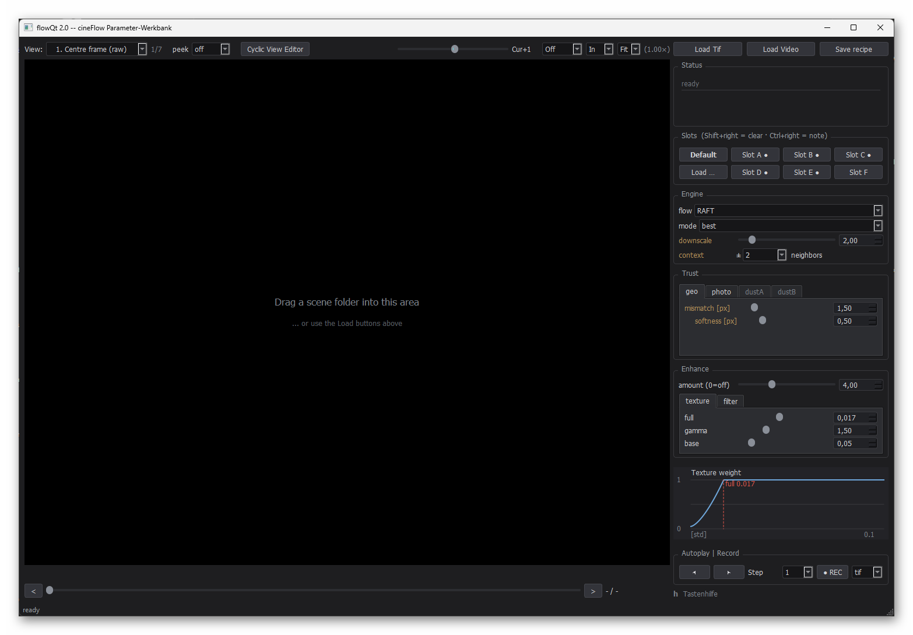

On the right you will see a wall of sliders. Ignore them. We will not
touch a single one in this section.

### 2.1.B Load some material

Simply drag a video file onto the large area. That is the entire
loading procedure. If your material sits as .tif frames in a single
folder, drop that folder instead — flowQt accepts both. Under WSL2
there is no drag and drop; the **Load Tif** and **Load Video** buttons
do the same job.

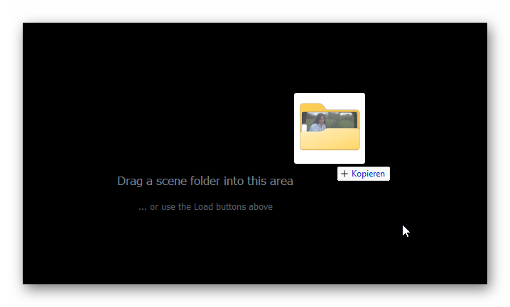

flowQt reads the file and shows you the first frame of the video.

### 2.1.C Switch to the Output view

Press **2**. The Status box on the right reports that something is
being computed, and the view switches to *2. Output (best)*. Give it a
few seconds — this is the real computation, not a preview.

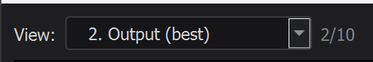

When the frame appears, press **cursor up**: you are back at the input
image. **Cursor down** returns to the output. Go back and forth a few
times; that comparison is what flowQt is for.

> **If you get lost in the views:** **1** always takes you to the
> input image, **2** always to the output. Whatever else is on screen,
> those two keys bring you back.

### 2.1.D Writing out the degrained result

At the bottom right there is a box labelled **Autoplay | Record**.

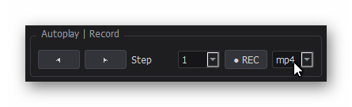


1. Go to the first frame of your footage (`Home`).
2. Make sure you are on the *2. Output (best)* view and the split-view
   option is off — it is off when there is no vertical yellow line.
   Press **l** until the line disappears.
3. Set the selector next to REC to **mp4**.
4. Press **REC**. The button turns red: recording is armed and
   running.
5. Press the **space bar**.

flowQt now runs from here to the end of the scene, computes every
frame and writes it to the video. When it reaches the end it stops on
its own and closes the file.

You will find it next to your material, in a folder called `_clips`.

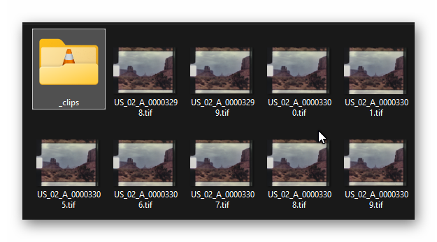

That is all. You have a degrained video, and you configured nothing.

---

## 2.2 One slider to rule them all

Now we adjust something. Exactly one thing.

In the **Enhance** box, at the top, there is a slider called
**amount**. This slider scales the effect of the whole Enhance stage;
at 0 the stage does nothing at all.

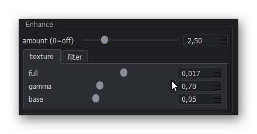

Stay on the `Output` view and work through the steps below in order.

### 2.2.A Set amount to 0

Drag the **amount** slider all the way to the left, until the field
next to it reads 0. The sliders below it grey out: the Enhance stage
is switched off, and what you see is the fused result on its own.

### 2.2.B Set amount to maximum

Now pull the slider all the way to the right. The full force of the
Enhance stage is now acting on the image.

On most material, it will look horrible. The software lifts everything
that looks like structure — and what *looks* like structure is not
always structure.

### 2.2.C Set amount right

Find the slider position where it looks right. For reference, use Up
and Down to switch between original (`Input`) and result (`Output`).

While testing the slider setting, zoom in — either with the scroll
wheel, or simply double-click to jump to 1:1 and back. To move around
the frame, drag with the left mouse button.

What you just did is the real work with this software. But it's only
the beginning.

> **Nothing you can break.** Double-clicking any slider resets that one
> to its default, and the **Default** button next to the slot buttons
> restores the factory settings altogether. Turn every knob you like;
> there is always a way back.

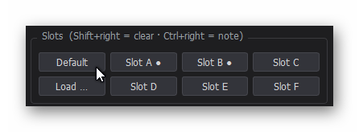

### 2.2.D Saving the recipe

Did you notice that the **Save recipe** button changed colour as soon
as you moved the slider?

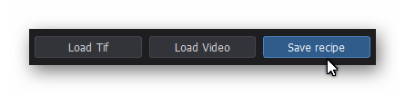

That means your current settings differ from what is stored. Press
the **Save recipe** button.

The moment you do this, flowQt writes a small text file next to your
material: `cineflow.json` for a folder, `<name>_cineflow.json` beside
a video file. It contains every number the current result was computed
with.

The button returns to its normal colour.

This file is more than a souvenir. It is the bridge to the next
section: **this is precisely the file the batch program reads.** What
you tuned by hand here, it will apply across a hundred scenes without
you touching a slider again.

*(And if it is in your way, delete it. Everything then falls back to
the defaults.)*

---

## 2.3 From one scene to a hundred

flowQt is built for looking and adjusting. It computes each frame at
the moment you ask for it. That is right while you are tuning, and
useless once the settings are found.

That is where the second program comes in. **cineFlow** has no window
and no sliders: only throughput. It computes the same stages as
flowQt, scene after scene, without asking you anything.

### 2.3.A What goes in, what comes out

```
python cineFlow.py /path/to/scenes /path/to/output
```

That is the whole command. cineFlow is pointed at a folder, not at a
single scene, and everything it finds inside becomes one scene: a
sub-folder full of TIFFs, or a video file.

```
scans/
├── Szene_1/              ← a folder of TIFFs: one scene
│   ├── Frame_00000001.tif
│   ├── Frame_00000002.tif
│   └── ...
├── Szene_2/
│   └── ...
└── USA_1981.mp4       ← a video file: one scene
```

The output folder works differently. cineFlow does not write into it
directly; it creates a sub-folder named after the moment the run
started, and everything from that run goes in there. Start a second
run and you get a second folder — nothing is ever overwritten.

```
out/
└── 2026-08-09_1835/
    ├── Szene_1/
    │   ├── Szene_1_000001.tiff
    │   └── ...
    ├── Szene_2/
    │   └── ...
    └── USA_1981.mov
```

Each scene comes back in the shape it went in: a folder of TIFFs stays
a folder of TIFFs, a video file stays a video file. The frame numbers
continue the numbering of the source, so a scene that started at frame
72 still starts at frame 72. Video output is written as ProRes 4444,
which DaVinci reads without complaint.

### 2.3.B What a run looks like

```
====================================================================
  CINEFLOW v2.0
  input:   /mnt/i/scans
  output:  /mnt/i/out
  run:     2026-08-09_1835/
====================================================================
[scenes] 3 scene(s) found
[space] estimated need: 4.05 GiB (uncertain, video input) | free on /mnt/i/out: 2415.14 GiB
  Szene_1: 69 Frames, ~0.95 GiB
  Szene_2: 129 Frames, ~1.77 GiB
  USA_1981: video, ~1.15 GiB (rough estimate)

[1/3] Szene_1  (tiff_dir)
  [best] 69 frames, 1800x1350 (TIFF) | downscale=2.00 | context=+-2 (8 flow calls/frame)
  [best] -> /mnt/i/out/2026-08-09_1835/Szene_1
  [best] 100.0% | Frame 69/69 | 1.87 fps | ETA: 0:00:00

[2/3] Szene_2  (tiff_dir)
  [config] no cineflow.json -- using defaults (best, RAFT, context=+-2)
  [best] 129 frames, 1800x1350 (TIFF) | downscale=2.00 | context=+-2 (8 flow calls/frame)
  [best] -> /mnt/i/out/2026-08-09_1835/Szene_2
  [best] 100.0% | Frame 129/129 | 1.84 fps | ETA: 0:00:00

[3/3] USA_1981  (video_file)
  [best] 240 frames, 1440x1080 (Video) | downscale=2.00 | context=+-2 (8 flow calls/frame)
  [best] Codec: prores4444
  [best] -> /mnt/i/out/2026-08-09_1835/USA_1981.mov
  [best] 100.0% | Frame 240/240 | 2.31 fps | ETA: 0:00:00
```

Four things worth reading in that:

- **The scenes are found by themselves**, and each one is announced
  with what it is: `tiff_dir` or `video_file`.
- **Disk space is estimated before anything runs**, per scene. If it
  does not fit, you are asked before the first frame is written. For
  video input the estimate is crude, and says so.
- **Szene_1 says nothing about its configuration, Szene_2 does.**
  Silence means a recipe was found and is being used. The `[config]`
  line appears only when there is none — then you are told what is
  being used instead.
- **Every scene reports what it is doing before it does it**: how many
  frames, at what resolution, with which settings, and where the
  result goes.

At the end you get a summary:

```
===============================================================================
  CINEFLOW v2.0  --  3 scene(s) in 0:03:56
===============================================================================
  scene              mode   downscale context  frames    fps  output
-------------------------------------------------------------------------------
  Szene_1            best        2.00     +-1      69   1.87  Szene_1
  Szene_2            best        2.00     +-1     129   1.84  Szene_2
  USA_1981           best        2.00     +-1     240   2.31  USA_1981.mov
-------------------------------------------------------------------------------
  total                                           438   1.86
===============================================================================
```

### 2.3.C Where the recipe comes from

There are three places cineFlow looks, each overriding the previous
one:

1. **Nothing at all** — the built-in defaults are used, and cineFlow
   says so:
   `[config] no cineflow.json -- using defaults (best, RAFT, context=+-2)`
2. **A `cineflow_folder.json` in the input folder** — applies to every
   scene in the run. This is the convenient route when most of your
   material should get the same treatment. cineFlow announces it in
   the header: `config:  cineflow_folder.json (applies to every scene)`
3. **A `cineflow.json` beside an individual scene** — the file flowQt
   wrote in 2.2.D. It overrides everything else, and cineFlow says
   nothing about it: silence means the scene has its own recipe.

Note that the folder file is only read in the input folder itself. One
placed inside a scene folder is not a folder config and will be
ignored.

#### The arrangement that saves you the most work

A reel usually consists of many scenes that were shot under similar
conditions and a handful that were not. That maps directly onto the
two files.

Tune one representative scene in flowQt — a normal one, nothing
special. Then **right-click** the **Save recipe** button. In the
dialog that opens, navigate up to your input folder, change the file
name to `cineflow_folder.json`, and save.

```
scans/
├── cineflow_folder.json     ← the general treatment
├── Szene_1/
├── Szene_2/
├── Szene_3/
│   └── cineflow.json        ← this one needed different settings
├── Szene_4/
└── ...
```

Now every scene is processed with the general recipe, except Szene_3,
which brings its own — saved there with a plain left-click on **Save
recipe**, as in 2.2.D. Twenty scenes, two files, one batch run.

One thing to know about this: flowQt writes a complete recipe, every
parameter that matters for the current mode, not just the ones you
changed. So a scene file does not inherit the folder settings and
adjust a few of them; it replaces them. If you tune a scene in flowQt,
tune it as a whole.

### 2.3.D The output codec

ProRes 4444 is the default for video input — something you can
actually keep working with, rather than a preview. If you want the
highest tier, ask for it:

```
python cineFlow.py /path/to/scenes /path/to/output --video-codec prores4444xq
```

### 2.3.E What else you get

Alongside the images, cineFlow drops a `cineflow_run.json` into every
output folder. It records the numbers used, how long it took, and
which version did the work.

When you come across a result six months from now and cannot remember
how it was made, the answer is sitting next to it.

---


## 2.4 The full quality, finally

So far we have worked with video files, because that is the shortest
route to a first result. For serious work it is the wrong one.

Every video file is compressed. The codec decides what it considers
unimportant and throws it away — and what it considers unimportant is
fine, irregular structure. Which is precisely what this software sets
out to collect across frames. It can only recover what
is still there.

The full route therefore uses **image sequences**: a folder of TIFF
files, one frame per file, uncompressed, 16 bit.

### 2.4.A How it goes

1. Export a TIFF sequence per scene from your editing program
   (16 bit, no compression).
2. Drag the folder into flowQt, exactly as you did with the video
   file. Everything behaves identically: views, sliders, Save recipe,
   REC.
3. Point cineFlow at it. It recognises scene folders on its own.

The output is another TIFF sequence, uncompressed. The file names
carry the **global frame number** from your source material, so that
everything lands back in the right order when you re-import it. The
layout is the one from 2.3.A: one folder per scene, TIFFs inside.

> **On compression:** leave it off when you export. With grainy
> material LZW does not make the files smaller, it makes them
> *larger* — grain is essentially incompressible, so all you get is
> the overhead. Measured on one frame, identical content: 13.9 MB
> uncompressed, 17.0 MB with LZW. It also costs time on every write
> and every read.

> **On getting the sequences in and out of your editing program
> (NLE):** chapter 9 has a working recipe for DaVinci Resolve. Other
> NLEs have not been tested yet.

### 2.4.B How large should the scan be?

Larger is not automatically better, and for this software it is often
worse — larger frames cost time, and the extra pixels rarely carry
anything the smaller ones did not.

Super-8 has a ceiling, and it is lower than the format's reputation
suggests. Kodachrome 25 resolves around 100 lp/mm on its own, but the
film never works on its own: the zoom lenses of the period contribute
their share, the pressure plate sits in the cartridge rather than in
the camera, and at 18 fps every handheld pan adds motion blur. What
comes out the far end of that chain is somewhere around 60 to 80
lp/mm, and 80 is generous.

An HD-sized frame — 1440 pixels across a 5.79 mm image — samples at
about 62 lp/mm. That is not a compromise. It is the size of the thing
being photographed.

There is still a good reason to scan at 4K, and it has nothing to do
with detail: an archival scan should record the physical state of the
film, grain and all, whatever the picture underneath is worth.
cineFlow does not sit there. It sits after the archive, in the chain
that turns the recorded state into something an audience can watch —
and for that, a scan around 1800 × 1350 is a comfortable working size.

---

# 3. Principle of operation

*(You can run the program without this chapter. But every view discussed in
chapter 6 and every setting in chapter 8 sits at one of the steps
described here, and without them they are hard to place.)*

## 3.1 Basic Concept

Chapter 1 claimed the software invents nothing. Here is why it does
not have to.

Anyone computing a clean image out of grainy material has three
obvious options: sharpen, which amplifies the grain along with
everything else; smooth, which takes the detail with it; or invent.

There is a fourth, and it rests on something obvious: **the world in
front of the camera was stable. The sampling was not.**

The wall stood still while the emulsion rolled fresh dice on every
exposure. The face moved steadily while the grain jumped. What behaves
*systematically* from frame to frame belongs to the scene; what jumps
does not.

That distinction can only be made in time. Within a single image it is
impossible — which is why every method that works frame by frame must
eventually guess or invent, and why this one does not have to.

cineFlow uses data from up to eight frames before and after a frame to
differentiate the real image signal from the noise.

## 3.2 The four steps

Each output frame is built in four steps. They are worth knowing
because every view in chapter 6 sits at one of them, and every setting
in chapter 8 acts on one of them.

| | step | what it does | what it costs |
|---|---|---|---|
| 1 | **Flow** | for every neighbour, work out how the picture moved from there to here, and shift it into place. Reconstructs geometry. | expensive |
| 2 | **Trust** | judge each shifted neighbour, pixel by pixel: is the motion consistent, does it still look like it belongs? | medium |
| 3 | **Fusion** | combine what the neighbours measured of the same point, each as far as it can be trusted | medium |
| 4 | **Enhance** | restore contrast in the fine structure — but only where there is structure, and only as far as the fusion vouches for it | cheap |

Step 3 is sensor fusion in the ordinary engineering sense, except that
the sensors are not different instruments but the same one at
different points in time.

Step 4 is not a sharpening pass bolted on at the end. It reads the
trust maps from step 2 and the result of step 3, so it knows where the
detail it lifts was actually measured — and leaves the rest alone.

The order also decides how long you wait. Change something in a late
stage and only that stage recomputes; change the flow and everything
after it goes with it.

## 3.3 Where the safeguard sits

Step 2 is the one that keeps the promise. The program does not simply
believe the shifted neighbour. For every pixel of every neighbour it
asks:

- Is the motion *consistent*? If you follow it there and back again,
  do you arrive where you started?
- Does the pixel *look like it belongs here*, or have brightness and
  appearance changed?
- Does it disagree with what the other neighbours agree on?

Where the answers come out well, the neighbour is blended in. Where
they do not, it is discarded and the input frame stands.

**That is the whole safeguard, and it is the reason nothing gets
invented.** When in doubt, nothing happens. An area the software is
unsure about stays as grainy as it was. That is sometimes
unsatisfying. It is always honest.

---


# 4. Getting around

The main display of flowQt always shows one frame. Two directions of
movement change what you see there: through the scene, frame by frame,
and through the views that show what the program computed for the
frame you are on. Both are driven from the keyboard.

What the individual views mean is chapter 6.

## 4.1 Moving through the film

Cursor-Left and Cursor-Right move through your footage, in steps that
depend on the modifier:

| key | |
|---|---|
| Cursor-Left / Right | one frame back / ahead |
| Shift + Cursor-Left / Right | 10 frames |
| `PageUp` / `PageDown` | frame −10 / +10, like Shift + Left/Right |
| Ctrl + Cursor-Left / Right | 100 frames |
| Home / End | first / last frame of the scene |

Paging to another frame is much faster on the `Input` view than
anywhere else, because nothing has to be computed there. Find the
passage you want on the `Input` view, then switch to the view you
need.

## 4.2 Moving between views

The views are arranged in a cycle. Cursor-Up and Cursor-Down step
through it, and it wraps around — keep going in one direction and you
come back to where you started. The keys `1`–`9` jump straight to a
certain view. The `View:` box shows which one you are on and how many
there are.

Out of the box the view cycle holds nine views:

| | | asks |
|---|---|---|
| 1–2 | Input, Output | how is the restoration doing? |
| 3–4 | Neighbour × trust, Neighbour (warped) | what actually went in? |
| 5–6 | Flow fw relative, Warped flow bw relative | was the flow to blame? |
| 7–8 | Trust geo, Trust photo | which of the two tests rejected it? |
| 9 | Sharp gate | and what does the sharpening make of it? |


Some views depend on which neighbour you are looking at — those carry
a ◆ in the list. Keys `n` and `m` step through the neighbours, and the
slider beside the view box does the same; the label shows which one
(`In+1`, `In-2`, …). Offset 0 is skipped, since the frame is not its
own neighbour. On views without a ◆ the slider is greyed out.

A view that is not in the view cycle cannot be called up at all — you
add it first, in the `Cyclic View Editor` (key `c`). The catalogue
holds more than the nine views above. The same view may appear more
than once, which is worth knowing if you work by flipping: put
`Output` between two diagnostic maps and Up/Down always brings you
back to the result.

If you get lost, `2` brings you back to the output — as long as you
have not rearranged the cycle.

## 4.3 Zoom and pan

Scroll wheel zooms around the pointer. `z` and `Shift+z` step through
the fixed zoom levels (Fit, 1×, 2×, 4×, 8×) forward and backward. A
double-click into the image toggles between `Fit` and the last level
you were on. Click and drag moves the frame.

`Fit` scales the frame to the window — enlarging it too, if there is
room — and the number beside the selector tells you what scale that
actually came out at. From `1×` on, the figure is image pixels per
screen pixel, not a percentage.

From 2× on the image is drawn unsmoothed — one image pixel becomes a
block of screen pixels, and the grain shows as it is rather than being
averaged away by the display.

> **Note:** most of what this program does happens below the size of a
> screen pixel at full-frame view. If you are judging grain, alignment
> or sharpening at `Fit`, you might have difficulty seeing it.

## 4.4 Flipping

Most views only mean something next to another one. Up-Down between
two neighbouring entries is the basic gesture of this program, which
is why the order matters more than it looks: put views you compare
next to each other.

This is also the fastest way to judge the result at all — flip between
`Input` and `Output` and watch what moves. The eye is far better at
spotting a change than at describing a difference.

> Another fun thing to do: compare the forward and backward flow
> images. In principle, they display the 3D image structure. In a
> perfect world, both should be identical. Normally, they are not.

For two views that are not neighbours in the cycle, the number keys do
the same job.

Key `p` writes the view you are looking at to disk, as a PNG, into a
`_snapshots` folder next to your material. The file name carries the
frame, the view and the settings it was computed with —
`f00101_output_best_RAFT_best_sc2_ctx1_sx3.png` — so that ten attempts
later you can still tell which was which. Nothing is ever overwritten;
a counter is appended instead.

## 4.5 Split-View Mode

Key `l` splits the frame between two views, with a divider you can
drag. Press it again to step through the different split layouts, and
once more to switch the mode off — the yellow line disappears.

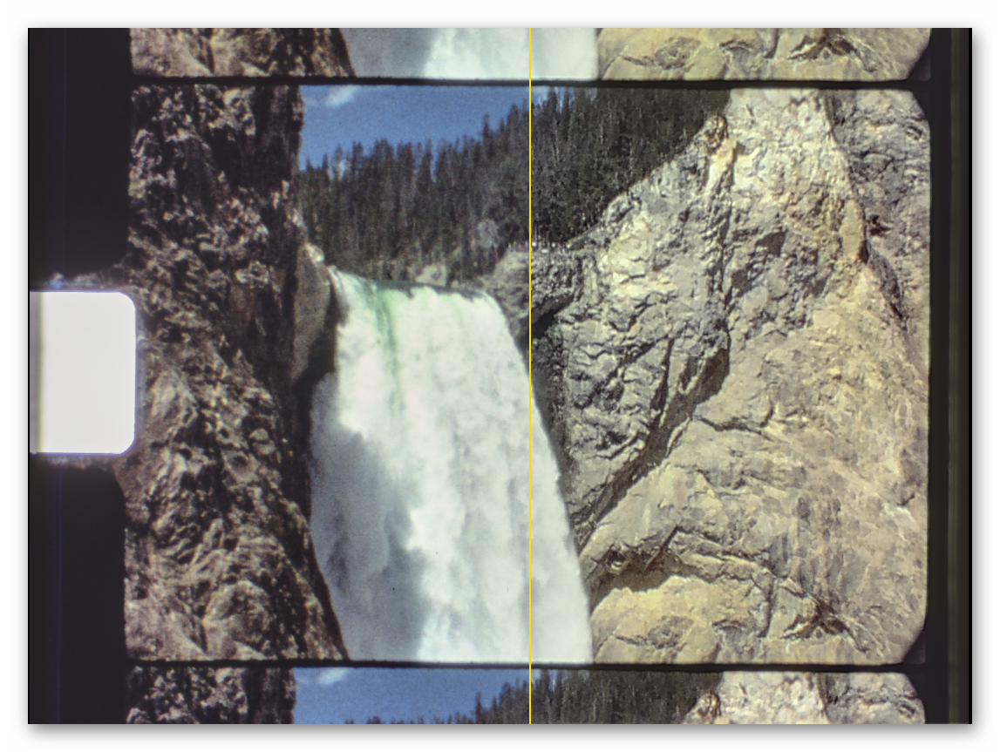

A small control above the display area shows which layout is active,
and lets you set it with the mouse instead:

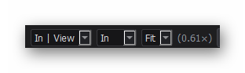

The box next to it decides what the current view is compared against.
Three references are available, and `k` steps through them:

- **In** — the untouched input frame.
- **Out** — the final result of the current mode. Use it to hold an
  intermediate view against what actually comes out: a trust map on
  one side, the finished picture on the other.
- **best** — the blend without dedusting. Only meaningful in the dust
  modes; it shows what the dedusting changed, in both directions
  (chapter 10). In mode `best` both sides are the same image, so the
  split stays off.

Now for the part that makes this worth using: the dragging. Park the
divider on a specific detail — an edge, a face, a caption — and sweep
it back and forth. Structure that sits in the same place on both sides
passes through the line without moving; anything misaligned jumps as
the line crosses it.


---

# 5. Best Practices

This chapter is about how to proceed and what to look for. The order
of the sections is the working order: it follows the four steps from
3.2, because each step reuses what the ones before it computed. Work
forwards and the program keeps up with you — change the flow after you
have set everything else, and all of it is thrown away.

## 5.1 Don't process a full reel

No single setting fits a whole reel, because a reel is not one thing.
The material you have scanned will normally hold quite a variety of
different scenes — dark ones, bright ones, from basically static to
filled with rapidly moving objects. It might even carry different film
stock: one scene on Kodachrome 25, the next on Agfa Moviechrome.

So split the reel into scenes, or into scene segments, before you
start — your favourite NLE will do it. Each of them then gets its own
tuned parameter file.

In the simplest workflow you find a good configuration for one scene
type, save it, and copy it to the scenes that resemble it.

> **Note:** scenes that take the same settings do not have to go one
> at a time. A run of similar scenes can go into the batch as one
> block — cineFlow handles the cuts inside it by itself.

## 5.2 Pick the right frame

Do not pick a pretty one. Take a hard spot — fast motion, a dark area, the
edge of a fast-moving object. What works there works everywhere.

Take it from **somewhere with neighbours on both sides**. Pressing
Shift+Cursor-Left once from the start puts you on frame 10, which is
enough for any context setting.

At the very first or last frame half the neighbourhood is missing, and
you would be tuning against a case that does not represent the scene.

## 5.3 Get the flow right first

Go to `Neighbour (warped)` and flip against `Input`.

`Neighbour (warped)` should look like your input frame. That is the
whole point of the operation: a correctly warped neighbour is a second
photograph of the same moment. Wherever it does *not* — smeared edges,
doubled contours, something in the wrong place — the flow got it
wrong.

Two settings have the largest influence. Start with the flow method:

| material | what to do |
|---|---|
| normal scenes | RAFT |
| large areas with little texture | RAFT — it fills in sensibly where DIS has nothing to hold on to |
| lots of small structure (branches, foliage, fences) | DIS at a low `downscale` |
| dirty material | dust mode, see chapter 10 |
| dirt *and* fast motion | clean it up in the NLE first |

Then **downscale**: larger values usually give smoother flow, at the
cost of fine structure, and run faster. RAFT has a lower bound here
that depends on your scan size; 8.1.C has the details.

The reason DIS is worth having at all is not accuracy. It runs on the
CPU, so it is not bound by the VRAM limit and can work at `downscale`
1.0 — and on fine structure a finer scale beats a better estimator at
a coarser one.

> There is a second difference, and it runs against intuition. Where
> there is no correspondence at all, RAFT fills the gap with smooth,
> self-consistent flow that *passes* the geometric test — so bad data
> gets blended in with full confidence. DIS fails visibly in the same
> place, the test rejects it, and the input frame is left alone. The
> worse estimator is the safer one here.


## 5.4 How many neighbours are worth having

`context` pulls in two directions. More neighbours give a more stable,
less noisy result; fewer of them cost less time. What decides the
upper end is the material: at some distance the flow no longer reaches
the centre frame, and any neighbour beyond that contributes nothing.

Stay on `Neighbour × trust` and step the neighbour outwards with `m`.
Watch where the map goes black: that is the reach of the flow on this
scene, and there is no point setting `context` beyond it.

Usually the reach is generous and compute time is the real limit. In
fast-moving scenes it can collapse at the very next neighbour — and
then you know it before the batch does.

The status bar puts a number on the same question:

```
Trust +-1:0.88  2:0.82  3:0.79
```

That is how much a neighbour at each distance still contributes on
average. Typically the numbers hold a plateau for a while and then
fall away. There is no point setting `context` beyond the point where
they drop: those neighbours add little to the result and cost flow
calls all the same.

How far the plateau reaches is entirely a matter of the scene. With a
lot of movement even the immediate neighbour can come out low — 0.4,
say — while on an essentially static scene the twentieth frame would
still have something to contribute. cineFlow allows ±8 at most.

## 5.5 Then adjust the trusts

Two gates, geo first, then photo. They test different things, and that
is why their maps look different.

**geo** checks the consistency of the flow computation. Fast-moving
objects that occlude parts of the image lead to larger dark patches in
the `Trust geo` map.

**photo** compares the pixel values a neighbour brings along with the
ones already there, one pixel at a time — which is why the
`Trust photo` map looks like a speckle pattern.

Each gate has two sliders: a threshold — how much error is still
acceptable — and a softness, which decides whether the transition from
accepted to rejected is abrupt or gradual.

Aim for as much white as possible — every black area is a neighbour
that did not help — and as much black as necessary: everything that
looked wrong in `Neighbour (warped)` must be black here.

The maps alone will not tell you when you are right. Check the result
as well:

- **geo too white** — artefacts along object edges. Compare `Neighbour
  (warped)` against `Neighbour × trust`: whatever looks strange at the
  edge of a fast-moving object should be safely dark in the second.
- **photo too white** — double contours on small, fast-moving objects.
- **either one too dark** — the noise in the output goes up. You have
  thrown away neighbours that would have helped.

This is the part to experiment with. The interaction between the two
gates is not obvious, and you need a feel for what each slider does to
the end result. If that is more work than you want: the defaults work
for most material.

## 5.6 Enhance last

The main control of the Enhance stage is `amount`. At 0 the stage is
switched off; useful values are roughly between 1.5 and 4.0.

Where in that range you end up depends on what the result is for, and
on the taste of whoever will watch it. Judge it both ways — against
`Input` (keys `1` and `2`, or Up/Down) and against the previous slider
position. Neither is better; they catch different things.

The status bar puts numbers on it:

```
HF -32% / +73% = +18%
```

High-frequency energy at three points of the chain, each against the
step before. The first is what the neighbour averaging took away —
negative is normal, that is the grain going. Strongly negative means
structure went with it. The second is what the Enhance stage gave
back, and it follows `amount` directly. The third is the result
against the input frame; the two multiply, so 0.68 × 1.73 gives the
1.18 of the third figure.

It is not a quality measure: grain and detail are both high frequency,
and this number does not tell them apart. It tells you what happened,
not whether it was right. Only the `Output` view fills it — the
diagnostic views have no blends at all.

Where the stage does its work, rather than how strongly, is chapter 7.

## 5.7 Always render a short test

Everything so far was judged on a still. Grain is not a still
phenomenon — flicker, pumping and crawling grain only exist in time,
and no single frame will show them to you.

So render a piece and look at it:

1. Go to a start frame.
2. Set REC to **mp4**, press **REC**, press **space**.
3. Let at least 100 frames run, if the scene has them.
4. Press **space** again to stop.

Then watch the clip properly. If something pumps or crawls, go back
and correct — usually the trust settings, sometimes `context`.

## 5.8 Save the recipe, then let the batch run

Press **Save recipe**. The file lands next to your material and is
exactly what cineFlow reads (2.2.D).

From here on flowQt is out of the picture. Point cineFlow at the
folder holding your scenes, give it somewhere to write, and leave it
alone:

```
python cineFlow.py /path/to/scenes /path/to/output
```


## 5.9 How to be wrong

- **Forcing the black open on the trust maps.** Where the warped
  neighbour genuinely went wrong, the trust map is *supposed* to
  reject it. Turning the sliders until the map is white is how
  invented detail gets back into the picture.
- **Working backwards.** Follow the data flow of the program; you get
  faster results.
- **Tuning on an easy frame.** It will look convincing everywhere
  except where it matters.

---

# 6. The views in detail

What each view shows, and what to look for in it. The ones in the
default cycle come first, in cycle order; the rest are further down
and can be brought in with the cycle editor (key `c`).

## 6.1 Input

The frame as it came off the film. Nothing computed here — no flow, no
trust, no blending.

This is the reference everything else is judged against, and it is
available inside all other views through the split-view option.

## 6.2 Output

The most important view: this is the picture that goes to disk. The
current mode appears in brackets — *Output (best)*, *Output (dustA)*.

`Out` in the split box refers to the same thing, so you can put the
final result beside any other view: a trust map on one side, what it
did to the picture on the other.

## 6.3 Neighbour (warped)

One neighbour frame, shifted by the flow so that it should line up
with the centre frame. This is where you see whether the flow worked:
a correct warp is a second photograph of the same moment, so this view
should look like `Input`. Smeared edges, doubled contours or something
sitting in the wrong place mean the flow got it wrong there.

Keys `n` and `m` pick which neighbour you are looking at; the label
next to the slider says which one (`In+1`, `In-2`, …). This is the
first view that makes use of them.


The neighbour offset is not limited by `context` — you can step past
the blend window and see how far the flow still carries on this scene.
5.3 says what to do with that.

## 6.4 Neighbour × trust

The same warped neighbour, multiplied by the trust it was given. This
is what the neighbour actually contributes to the output: bright where
it was accepted, black where it was rejected.

Flip between this view and `Neighbour (warped)`. Everything that
looked wrong over there must be black here — that is the gate doing
its job. Large black patches come from geo, fine speckle from photo.

> **Read the black with care.** The image is the neighbour *times* the
> trust, so a dark area can mean two things: the trust rejected it, or
> the picture is simply dark there. For the trust on its own, use
> `Trust geo`, `Trust photo` and `Trust` (6.5, 6.6).

## 6.5 Trust geo · Trust photo

The two gates, one view each. White = full confidence, black = full
doubt, grey everything in between.

What the two test and how they differ is in 5.4.

After a while you will set both faster on `Neighbour × trust`.

## 6.6 Trust

Everything geo and photo worked out, condensed into one number per
pixel.

`Neighbour × trust` answers "what did this one neighbour contribute";
this one answers what the neighbourhood as a whole had to offer. White
means the neighbours came through, dark means the frame is largely
left to stand on its own — and will still be as grainy as it started.

The current mode appears in brackets, and the map differs accordingly:
in `best` the neighbour weights are geo × photo, in the dust modes
geo × group consensus.

## 6.7 Sharp gate

The sharp gate is the interface between restoration and enhancement:
it is what the Enhance stage is fed with. In practical use it is the
most important display — but it takes a while to read.

Read it like this: dark areas are not enhanced at all, bright areas
are, either directionally with a Guided Filter or evenly with a
classical unsharp mask, depending on the filter you chose.

Its appearance is largely controlled by the sliders of the `texture`
tab, `full` and `gamma` above all (7.3).

## 6.8 Flow fw · Warped flow bw · relative variants

These are internal views. You do not need them for normal work, and
nothing here is meant to be read like a picture.

The flow is the program's attempt at working out what moved where
between two frames. The forward view shows the estimate from the
centre frame to the neighbour, the warped backward view the estimate
in the other direction, brought into the same coordinates. In a
perfect world the two would agree.

The motion is drawn in colour: the hue gives the direction, the
brightness the amount. Which hue means which direction does not matter
much in practice — what you look at is whether neighbouring areas
share a colour or break up into a patchwork.

That is the recipe: flip between them. Whatever stays put is an
estimate the program can rely on. Whatever jumps as you switch is a
place where the two directions disagree — and that is exactly where
the geo gate will reject the neighbour.

Both come in an absolute and a relative variant. The relative ones
subtract the dominant motion and show what is left over, which makes
small local movement visible under a camera pan; the absolute ones
show the full motion including the pan. The view cycle carries the
relative pair out of the box (4.2); the absolute ones are in the
catalogue.

Within a variant the scale is shared, so those views are directly
comparable: same colour means same direction, same brightness means
same speed — forward against backward, and neighbours at any
distance against each other, since the display divides by the
neighbour offset. Absolute and relative do *not* share a scale.
Comparing brightness across the two says nothing, because the
relative pair shows only the residual after the dominant motion has
been taken out.

## 6.9 Texture weight

Displays where the Enhance stage *would* work, judged on image
structure alone. Bright means "there is fine structure here worth
lifting", dark means "this is smooth, leave it alone". Controlled
entirely by the `texture` tab.

Its use is the comparison with `Sharp gate`, which is this map
multiplied by `Trust`:

- dark in both → your texture threshold rejected the area.
- bright here, dark in the gate → the structure is there, but the
  blend was not trusted enough to sharpen it.

That is the difference between turning the texture settings and fixing
the trust, and it is the only place you can tell the two apart.

---


---
# 7. How the Enhance stage decides

`amount` sets how strongly the Enhance stage acts. *Where* it acts is
decided by three more controls, and by a measurement the program makes
on your material. This chapter is about that decision, because getting
it right is most of what separates a good result from a sharpened
mess.

## 7.1 What is measured

For every pixel, cineFlow computes the **local standard deviation** of
the image around it. Flat sky comes out near zero; a stand of birch
trees comes out high. That number, and nothing else, is what the stage
calls texture.

It is a measurement of the picture, not of the restoration — grain
raises it just as readily as real structure does. Telling the two
apart is not this stage's job; that is what the trust maps did, two
steps earlier.

The status bar carries the measurement:

```
Adaption 39%    Tex p90 0.047 vs full 0.049
```

`p90` is the 90th percentile of the texture across the frame: nine
tenths of the picture is less textured than this. `full` is the
control you set. Their relationship is the whole game, and 7.3 says
what to do with it.

**Adaption** is the short answer to the same question: how far up the
curve the frame actually sits, from the floor (0 %) to full strength
(100 %). High means the stage is following the texture — strong on
structure, gentle on smooth areas. Roughly 30 to 90 % is a working
range. Below that the curve is barely doing anything, and the display
turns orange to say so.

## 7.2 The histogram

Key `t` lays the distribution over the image:

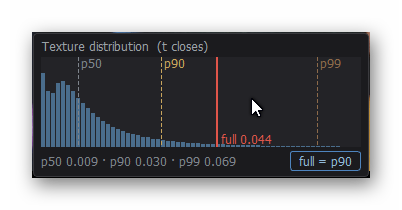

The dashed lines mark `p50`, `p90` and `p99`, with the values spelled
out underneath; the red line is where `full` currently sits. That line
is the boundary: everything to the right of it gets the full
treatment, everything to the left is scaled down along the texture
curve — the further left, the less.

Setting `full` to the p90 is the usual choice, and that is what the
**full = p90** button in the corner does in one click.

## 7.3 The curve

Between "no texture at all" and `full` the stage does not simply
switch on. It follows a curve, and `full`, `gamma` and `base` are its
shape:

- **full** — the texture value at which the curve reaches the top.
  Everything above it gets the full treatment.
- **gamma** — what happens in between. At 1 the rise is linear. Above
  1 the middle is pushed down, so only clear structure is lifted.
  Below 1 the curve rises steeply from the start, and faint texture
  already gets most of the treatment.
- **base** — the floor: what a completely textureless area still gets.
  Normally you want this at or near zero.

The plot on the right shows this curve while you work — and it always
shows the curve of the tab you are currently touching, so it follows
you from geo to photo to texture without your having to ask.

One thing the curve does *not* contain is the trust. The stage
multiplies its result by the trust map afterwards:

```
gate = curve(texture) x trust
```

So `base` is not a way of forcing sharpening into untrusted areas.
Where the trust is zero the gate is zero, whatever the floor says.

## 7.4 What it costs to get it wrong

**`full` far above the p90** (say 0.30 against 0.03): the curve never
leaves its base, and almost nothing is enhanced. The stage runs and
does nothing. This is the one case the program flags by itself —
Adaption drops towards zero and the display turns orange.

**`full` far below the p90**, down among the grain: flat areas reach
full strength, and grain gets lifted as though it were structure. This
is the failure that looks like the software is working — it is sharp,
but it is sharpening the wrong thing.

**`base` raised well above zero**: everything gets some treatment
regardless of its texture. That can be deliberate — a raised floor
brings back a fine, even structure in the flat areas instead of
leaving them smooth, which reads as film rather than as video. Values
around 0.4 to 0.5 do this without the result going noisy. It is a
finishing touch, not a starting point.

Which settings you end up with depends on the material and on taste.
Fine-grained stock takes different numbers from a coarse one — K25
against an AGFA emulsion is a noticeable step — and what looks right
on a screen is not what looks right projected.

---

# 8. The settings in detail

Every setting in the right-hand panel, top to bottom — the order in
which you meet them, and roughly the order in which you touch them.

Each one belongs to a step from 3.2 ("The four steps"). Note that
**step 3, the fusion, has no settings of its own**: it is steered
entirely through the trust maps of step 2. If you are looking for a
blend control, that is why there is none.

A double-click on a slider puts it back to its default; `d` puts all
of them back at once.

## 8.1 Engine

Two flow estimators are implemented, in flowQt as well as in cineFlow.

RAFT is a neural-network based algorithm and needs the appropriate
hardware and support libraries to run. DIS is an OpenCV algorithm and
always runs — even without a CUDA-enabled GPU. Other optical flow
algorithms were tested, with mixed results; they are no longer
available in the present version of the programs.

### 8.1.A `flow` — RAFT / DIS

Selects which optical-flow estimator computes the motion between
frames. Default RAFT. Key `r` toggles between RAFT and DIS.

> **Note:** if RAFT is not available, DIS stands in for it. The
> selector then turns orange and its tooltip says what is missing; the
> preview computes with the other method while the recipe keeps what
> you chose. That is the point: you can work out most settings on a
> machine without a GPU and still write RAFT into the recipe for the
> batch machine. The result will not be identical, though — the two
> estimators fail in different places.

### 8.1.B `mode` — best / dustA / dustB

Defaults to `best`, which is the degraining mode. `dustA` and `dustB`
additionally go after dust and small damage; they are useful, but have
had far less attention than the degraining, so expect to do more of
the work by hand there. Chapter 10 covers them.

In the two dust modes the `photo` sliders lose their effect and are
greyed out, and `Trust`, `Sharp gate` and `Output` carry the mode in
their title.

### 8.1.C `downscale`

A *divisor* of the flow input, not a scale: 2.0 means half the edge
length, 1.2 means 83 %, 1.0 would be full resolution. Cost grows
*quadratically* — going from 2.0 to 1.2 is about 2.8× the pixels.

The larger the value, the smoother the flow field: less grain for the
estimator to lock onto, but also less structure for it to follow.
Small, fast-moving detail is the first thing to go.

There is a lower bound, and it depends on the backend. RAFT works
within a fixed pixel budget, so at a given scan size it cannot go
below a certain value — at 1800 × 1350 that is about 1.2. flowQt
enforces this: it raises the slider by itself and says so in the
status bar. DIS runs on the CPU and allows 1.0 at any size.

If a run slows to a crawl instead of failing, the card is out of
memory and the driver is papering over it — see section 8.6 of
[INSTALL.md](INSTALL.md).

### 8.1.D `context`

How many neighbour frames on each side are taken into account — for
the fusion in `best`, for the committee in the dust modes. Each one
costs two flow calls, so cost grows linearly, while the benefit grows
only with √N.

How to find the right value for a scene: see 5.3 ("How many neighbours
are worth having").

## 8.2 Trust

Each tab has the same two controls, and they always mean the same
thing. **mismatch** is the threshold: how much error is still
acceptable, or more precisely the error at which trust has fallen to
0.5. **softness** decides whether the transition from accepted to
rejected is abrupt or gradual. Smaller values are stricter.

Tabs that do not apply to the current mode are greyed out, and their
tooltip says which mode they belong to.

Only the unit changes:

### 8.2.A geo tab — `mismatch` [px] · `softness`

Measured in real pixels: the forward-backward inconsistency of the
flow. Follow the motion there and back again — how far from the
starting point do you land?

Judged on `Trust geo`, or faster on `Neighbour × trust`, where geo
failures show as *large connected patches*.

Values between 1.0 and 4.0 px cover most material.

### 8.2.B photo tab — `mismatch` [0..1] · `softness` · `smooth` [px]

`mismatch` is the allowed difference in normalised image intensities,
measured after smoothing over `smooth` pixels. That smoothing is what
keeps the test from reacting to grain — which differs between every
pair of frames by construction, and would otherwise fail the test
everywhere.

What the test catches are exposure and appearance changes at places
where the geometry is perfectly correct — that is the division of
labour between the two gates. A larger `smooth` also settles the map
in time: the trust flickers less from frame to frame.

Photo failures show as *fine speckle* on `Neighbour × trust`. Speckle
everywhere means the threshold is too tight for material this grainy.

These settings have no effect in the dust modes.

### 8.2.C dustA tab — `mismatch` [MAD] · `softness` · `center_weight`

Only active in `dustA`. Measured in multiples of the MAD — the spread
within the group of frames. A pixel that sits `mismatch` MADs away
from the group median is no longer trusted.

`center_weight` is how many votes the input frame gets in that group.
It balances dust removal against fast-moving objects: the more weight
the centre frame carries, the less readily the group can outvote it.
Normal value is 1.

### 8.2.D dustB tab — `mismatch` [spread] · `softness` · `disagreement` [0..1] · `softness` [0..1]

Only active in `dustB`. Same curve as dustA, but the spread comes from
a committee that *excludes* the input frame — which is what lets it
judge the input frame at all, and means a defect sitting *on* the
input frame can be caught too.

`disagreement` is a second gate on the committee itself: where the
neighbours do not agree among themselves, their verdict on the input
frame is worthless and is not acted on. Its effect is hard to see, and
no material has turned up so far where moving this slider made a
visible difference. It is there because the case exists, not because
you will need it.

## 8.3 Enhance

The `Enhance` box steers step 4 ("Enhance") of 3.2.

### 8.3.A `amount`

The master control of the stage: at 0 the stage is skipped entirely,
not merely set to no effect. Useful values are roughly between 1.5 and
4.0. 2.2 ("One slider to rule them
all") walks through it at 0, at maximum, and in between; 5.5 ("Enhance
last") says what to judge it by.

### 8.3.B texture tab — `full` · `gamma` · `base`

These three decide *where* the Enhance stage does its work — the shape
of the curve it follows between smooth and textured. The **full = p90**
button beside them sets `full` to the measured p90 texture level of the frame,
which is the usual starting point.

What the three do, and how to read the plot and the histogram while
setting them, is chapter 7.

### 8.3.C filter tab — guided / gauss · `sigma` · `eps`

This tab defines the base filter of the Enhance process. Two are
available: a classical unsharp filter (here called `gauss`) and a
directional one (`guided`). Your usual choice should be `guided`. Key
`g` toggles between them.

- **sigma** — the size of the structure being lifted, in pixels. With
  `gauss` it is the frequency cutoff instead. Match it to the finest
  real detail you want to keep: at 268 px/mm the finest thing the film
  holds is about 3 px across, and `sigma` 0.5 puts the cutoff right
  there. Work out the equivalent for your own scan.
- **eps** — for the guided filter only: how strongly it distinguishes
  an edge from a flat area. Small (0.01) is strongly edge-preserving;
  above 0.1 it approaches a box filter and loses exactly the property
  `guided` was chosen for. With `gauss` it has no effect.

Set `sigma` first and leave it: it also fixes the window the guided
filter works in, and therefore what `eps` is measured against.


## 8.4 Slots

Six memories for complete parameter sets — everything a recipe holds,
kept inside flowQt rather than next to your material.

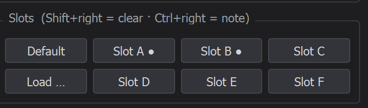

- **Left click** loads a slot.
- **Right click** stores the current settings in it.
- **Shift + right** clears it, after asking.
- **Ctrl + right** attaches a short note, which then shows up in the
  tooltip along with the main values.

A slot that holds something carries a `●` behind its name, and it
lights up when its contents match what you have set right now. That is
worth watching: it tells you at a glance whether you are still on a
stored set or have drifted away from it.

`Default` (key `d`) restores the factory settings and behaves like a
slot in every other respect. A double-click on a single slider resets
just that one.

**Load …** reads a recipe from a file: a `cineflow.json`, or the
`cineflow_run.json` that a batch run leaves beside its output — so the
settings of a finished run can be picked up and carried on with. It
takes only the parameters it knows; anything else in the file is
ignored, and whatever the file does not mention stays as it is. That
is deliberately more forgiving than the batch, which stops on keys it
does not recognise.

Slots survive restarts and are independent of the material you happen
to have open — they are for the settings you keep coming back to.

> **Note:** **Save recipe** writes the other half: it writes the current
> settings next to your material, where cineFlow reads them. The
> button changes colour as soon as your settings differ from what is
> stored there. Key `e`; 2.2.D covers the workflow.

## 8.5 Autoplay and Record

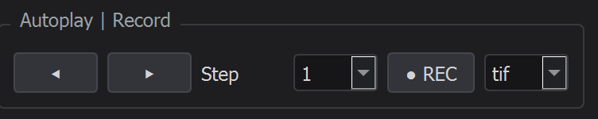

### 8.5.A Step, play / pause

The two buttons run the scene backwards and forwards; `y` and `x` do
the same from the keyboard, and `space` starts and stops a forward
run. Pressing again stops it.

**Step** is how many frames each step advances, from a fixed list: 1,
2, 5, 10, 20, 50, 100, 200. At 1 you see every frame, which is the
setting for judging grain; larger values move through the scene
faster.

During a run you can change the view with Up/Down or 1–9 without
stopping it. However note: your modifications will be recorded.

### 8.5.B REC — mp4 / tif

Arms the recorder (key `u`) — nothing is written yet. Start a run and
every frame it computes goes to disk, into a `_clips` folder next to
your material: `<scene>/_clips/clip_NNN.mp4` for video, or a folder
`<scene>/_clips/clip_NNN/` of single TIFF frames, numbered in the
layout cineFlow itself uses.

What lands there is what is on screen. Change the view during a run,
switch the split on, drag the divider, move a slider — all of it goes
into the clip. That can be exactly what you want for showing someone
what a setting does, and it is a nuisance when you meant to record a
clean result.

The box beside it picks the format. Take **mp4** for a quick look —
written at 18 fps with the `mp4v` codec, which every player reads and
nobody would archive — and **tif** when the result has to survive. The
batch writes ProRes 4444 instead (2.3.D).

---

# 9. Export from your NLE

*At this point in time this chapter is only applicable to DaVinci
Resolve. Other editing programs will have equivalent settings, but
none of them have been tested.*

Chapter 2.4 said the full route uses image sequences rather than video
files. Getting them out of the NLE in a form cineFlow can use is
mostly a matter of four settings, and one of them is easy to get
wrong.

## 9.1 The export settings

In the Deliver page, set:

| setting | value |
|---|---|
| Export | **Individual clips** |
| Filename | **Custom name**, `Frame_` |
| File subfolder | `Szene_` + the *Timeline Index* variable |
| Place clips in separate folders | **off** |
| Each clip starts at frame 1 | **off** |
| Format | TIFF, 16 bit, **no compression** (see 2.4) |

*Timeline Index* is an internal DaVinci variable, not text you type.
Type `%` in the field and DaVinci offers a list of variables that
narrows with every further letter:

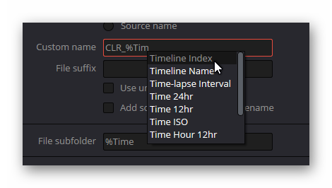

Pick the one you want and it turns into a rounded chip inside the
field, next to whatever you typed yourself:

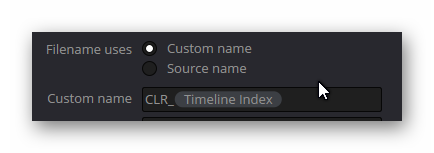

So the subfolder field holds the literal text `Szene_` followed by the
*Timeline Index* chip — there are no square brackets anywhere, they
are only used in this manual to name the variable.

The result is one folder per scene, and inside it files named like

```
Szene_2/Frame_00000072.tif
```

> **The one setting that matters.** The checkbox at
> `Each clip starts at frame 1` must be **off**. With it on, every
> scene restarts its numbering at 1 and the
> connection to the source timeline is lost — the files still look
> fine, and you will not notice until you try to put the result back.
> With it off, the number in the filename is the frame's position in
> the whole timeline, and it stays true through the entire round trip.

*Timeline Index* does not pad with zeros, so you will get `Szene_2`
next to `Szene_10`. That is expected; cineFlow sorts scene folders
naturally and reads them in the right order.

## 9.2 Coming back

cineFlow writes another TIFF sequence, uncompressed, and keeps the
filenames. Because the numbers are global timeline positions rather
than per-scene counts, re-importing is unremarkable: every frame lands
where it came from.

Import the whole output folder into DaVinci — the one named after the
run, with all the scenes inside it. Each scene folder is recognised as
one clip, and the media pool will usually have them in the right order
already.

To be sure of it, go to the Cut page, sort the clips alphabetically,
select them all (`Ctrl+A`) and drag them onto the timeline. They land
in the order they were shot, with all the cuts where they were.

---

# 10. Dust and scratches

The machinery built for grain has a second use. Instead of asking *is
this neighbour consistent with the input frame* — which is what photo
trust does — it can turn the question around and ask *does the input
frame agree with the others*. Where it does not, the input frame is
the odd one out and gets replaced.

That catches short-lived damage: dust, hairs, a scratch that lasts a
frame or two.

There are two modes for it, `dustA` and `dustB`. They differ in how
the consensus among the neighbours is formed: in `dustA` the input
frame is a member of the committee that judges it, in `dustB` it is
not. Excluding it has a second effect — where the neighbours disagree
among themselves, the input frame is left alone, which protects it
exactly where the flow estimator is struggling. `dustA` is generally
the slightly better performer; `dustB` is the alternative for scenes
where A removes too much. Which one suits your material is something
you will have to try.

In most material the result is barely distinguishable from `best`.


> **What it cannot tell apart.** The method has no idea what dust
> *is*. It knows only that something was there in one frame and in no
> other. A light that blinks for a single frame looks exactly like
> that — and will go the same way as the dirt. So will a spark, a
> camera flash, and the one frame in which someone blinked.

Here is an example — left the input, right the result of the dustA
mode. The dust is gone, and with it the grain: the dust modes do not
replace the degraining, they are the degraining with the question
turned around.

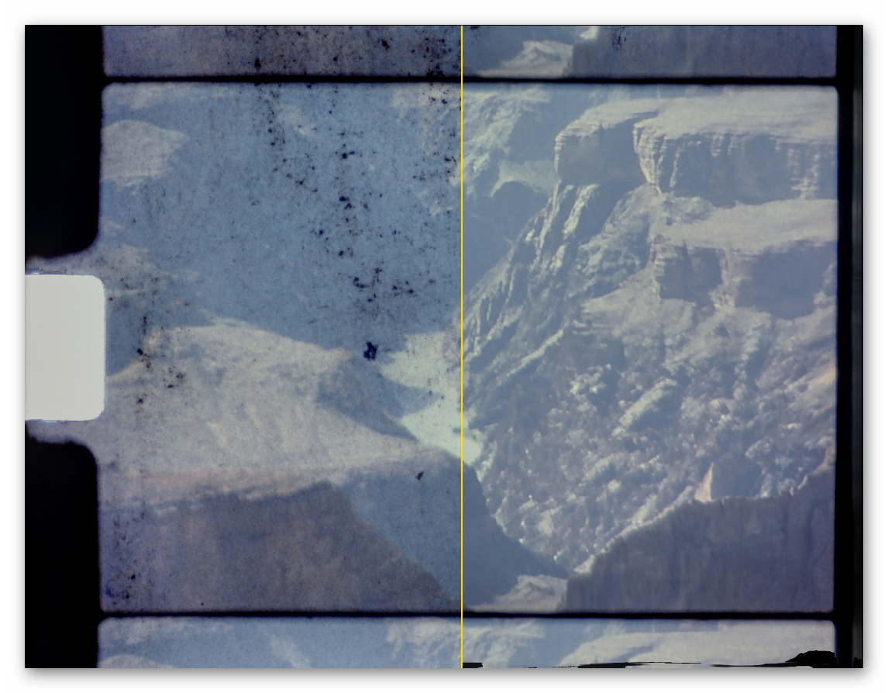

---


# Appendix — Keyboard reference

The same list the program shows on `h`. If the two ever disagree,
believe the program.

## A.1 Navigation

| key | |
|---|---|
| `Left` / `Right` | frame ±1 |
| `Shift` + `Left` / `Right` | frame ±10 |
| `PageUp` / `PageDown` | frame −10 / +10, like Shift + Left/Right |
| `Ctrl` + `Left` / `Right` | frame ±100 |
| `Home` / `End` | first / last frame of the scene |
| `Up` / `Down` | step through the views |
| `1` … `9` | select a view directly (the number is shown in the list) |
| `n` / `m` | test neighbour, inward / outward |

## A.2 View

| key | |
|---|---|
| `z` / `Shift+z` | zoom step up / down (Fit, 1×, 2×, 4×, 8×) |
| Mouse wheel | zoom around the pointer |
| Double-click on the canvas | Fit ↔ last zoom step |
| Click and drag | pan |
| `l` | split on / off |
| `k` | split reference: In / Out / best |
| `t` | texture histogram overlay on / off |
| `g` | detail filter (guided / gauss) |
| `r` | flow backend (RAFT / DIS) |
| `c` | edit the view sequence |

Dropping a config `.json` on the canvas applies it.

## A.3 Autoplay and recording

| key | |
|---|---|
| `space` | play / pause: start a forward run, or stop it |
| `x` / `y` | autoplay forward / back (again stops) |
| `u` | start / stop recording |

During a run, `Up`/`Down` and `1`–`9` change the view **without**
stopping it.

## A.4 Parameters and files

| key | |
|---|---|
| `d` | load defaults (all parameters) |
| Double-click on a slider | that slider's default (on the label or the slider, not the number field) |
| `e` | export `cineflow.json` |
| `p` | save the current view as PNG |
| `h` | this list |

Slot buttons: **L** = load · **R** = store · `Shift`+**R** = clear ·
`Ctrl`+**R** = note.
