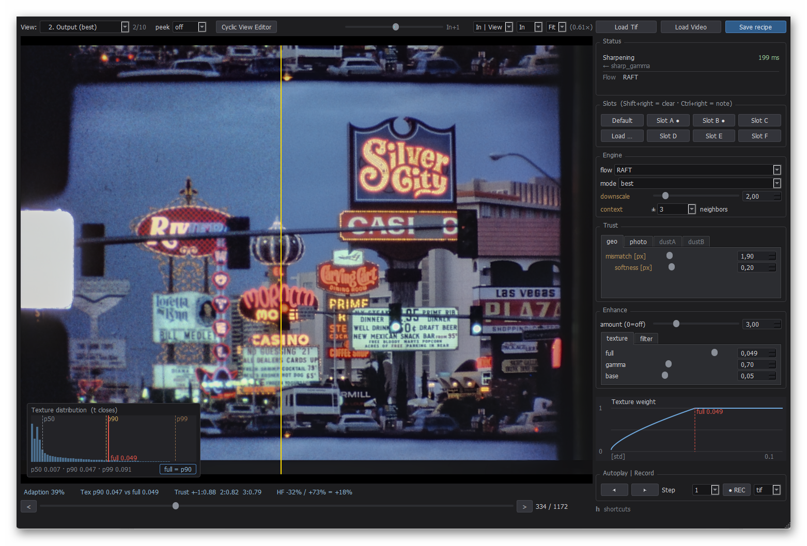

# cineFlow — Degraining and Recovery

In the old days of analog media, major efforts were made to reduce the 
intrinsic film grain of the medium. Film grain covers image detail, 
especially in darker areas of a frame.

This software takes a fresh approach to removing film grain digitally,
with the explicit goal of recovering as much of the original image
detail as the material allows. The software was carefully designed
not to "invent" spurious image detail.

The same machinery should also work on noisy video — more easily,
even, since the higher frame rate provides more usable samples per
frame. Film is the harder case it was built for.

## What it does

cineFlow reads raw scanner output — or any other frame sequence — and
examines each frame together with its neighbours in a sliding window.
Within that window it separates what is grain from what is genuine
image content, and writes out the cleaned result.

A detail in a film almost never lives in a single frame — the camera
exposed the same corner of the house, the same face, the same treetop
two, five, twenty times. The grain fell differently on every exposure;
the corner of the house did not.

Follow a detail reliably across several frames, combine its signature
from several samplings, and you end up with something that *was* in
the film but was never cleanly visible in any one frame. The world in
front of the camera was stable; only the grain was not.

Every neighbouring frame is checked before it is used: is the motion
consistent, does the pixel still look like it belongs, does it disagree
with what the others agree on? Where the answers are bad, the neighbour
is discarded and the original frame stands. An area the software is
unsure about stays as grainy as it was. That is sometimes
unsatisfying — it is always honest.

## The two programs

Restoration alternates between two very different activities: working
out the right settings for a scene, and applying them to a few thousand
frames. These are kept apart.

| | |
|---|---|
| **flowQt.py** | interactive front end. One frame at a time, sliders, a set of diagnostic views. This is where you work out the settings for a scene and save them as a recipe. |
| **cineFlow.py** | batch processor. No window, no sliders. Point it at a folder of scenes and it applies the recipes across all of them. |

Both use the same computation, so what you tune in flowQt is what the
batch produces.

## Getting started

- **[INSTALL.md](INSTALL.md)** — installation, from a machine with no
  Python on it to a first batch run. Tested end to end on Linux Mint
  and on Windows, both natively and under WSL2.
- **[MANUAL.md](MANUAL.md)** — the manual (first version, gaps marked).
  Chapter 2 gets you a degrained clip in five minutes without
  understanding anything; everything after that is about doing it well.

You need Python 3.11 or 3.12 and four packages; INSTALL.md has the
details. Everything runs on the CPU; a CUDA GPU is optional and makes
it a great deal faster.

## Status

This is version 2.0 of the software: working software that one person
uses on his own film, published in the hope that it is useful to
others.

Some parts of the program — the dust removal modes in particular —
work but have had far less attention than the degraining itself.

**No support is promised.** Bug reports are welcome and will be read.
Questions of the form "it does not run on my machine" are best asked
with the console output of the failed run attached — the banner the
program prints on startup says what it found and what it did not.

## Licence

GPL-3.0-or-later. See [LICENSE](LICENSE).

Commercial licences are available for use cases the GPL does not cover.
Enquiries: license@pixelcircus.com

Copyright (C) 2026 Dr. R. Henkel
